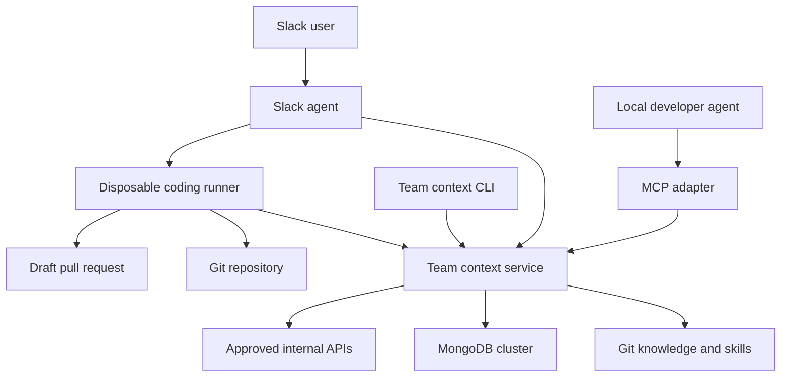

# Team Agent Extension Architecture and Implementation Plan

> **Superseded archive:** Retained only as planning history. Use the canonical Genkit brief and the
> normative domain-authority dogma. This file's memory-promotion and per-artifact access-group model
> must not be implemented.

**Status:** Proposed implementation brief  
**Audience:** Coding agent and engineering team  
**Primary goal:** Build a provider-neutral team extension that gives hosted and local agents access to approved domain knowledge, reusable skills, persistent memory, and narrowly scoped tools.

## 1. Executive decision

Build a monorepo that produces three independently runnable container images:

1. **Slack agent** — receives Slack events, manages conversations, invokes a model through an agent SDK, and coordinates work.
2. **Team context service** — owns knowledge retrieval, persistent memory, skills discovery, authorization, and internal tool adapters. It exposes REST first, with MCP and CLI adapters over the same application services.
3. **Coding runner** — executes one repository task in a disposable workspace using Codex CLI, Claude Code, or another coding harness, produces a validated patch or draft PR, and exits.

The repository will contain Dockerfiles and a development Compose file, but no Kubernetes, ECS, Nomad, or other production orchestrator configuration. Durable data lives outside container filesystems. Authoritative skills, conventions, and domain documents live in Git; searchable representations, runtime state, and dynamic memory live in a MongoDB cluster.

## 2. Goals

- Make team domain knowledge available in Slack and in developers' local coding agents.
- Provide persistent, scoped memory across agent sessions.
- Package specialized team workflows as discoverable skills.
- Prevent the extension from affecting unrelated personal work.
- Support both lightweight Q and A and isolated repository-changing tasks.
- Support event-triggered and scheduled automations using the same agent runtime and skills.
- Remain portable across OpenAI, Anthropic, and future model or agent providers.
- Enforce identity, authorization, approvals, and auditability outside model prompts.
- Return citations and source revisions with knowledge-grounded answers.

## 3. Non goals for the first release

- Reimplement a general-purpose coding harness.
- Automatically merge or deploy changes.
- Give agents unrestricted database, production, shell, or Git access.
- Build production deployment manifests.
- Support arbitrary autonomous multi-agent planning.
- Treat generated memories as authoritative without review.
- Index every internal source before validating a narrow useful workflow.

## 4. System context



MCP is an adapter, not the architecture. The core product is the team context service. REST, MCP, and CLI must call the same application-layer operations and enforce the same policies.

## 5. Component responsibilities

| Component | Owns | Must not own |
|---|---|---|
| Slack agent | Slack verification, thread mapping, run orchestration, model calls, user interaction | Authoritative knowledge, raw database access for shared memory, repository execution |
| Team context service | RAG, memory, skills, authorization, audit, internal tool adapters | Slack-specific state, arbitrary model orchestration |
| Coding runner | Checkout, coding harness invocation, tests, diff validation, optional draft PR publication | Long-lived conversations, production mutations, durable memory authority |
| MongoDB cluster | Runtime state, indexed chunks, embeddings, memories, audit records | Canonical copies of Git-owned conventions unless explicitly promoted |
| Git content | Approved knowledge, skills, ADRs, conventions | Ephemeral conversation history |

## 6. Monorepo layout

```text
team-agent/
├── apps/
│   ├── slack-agent/
│   │   ├── src/
│   │   └── tests/
│   ├── context-service/
│   │   ├── src/
│   │   └── tests/
│   ├── coding-runner/
│   │   ├── src/
│   │   └── tests/
│   └── team-context-cli/
├── packages/
│   ├── contracts/
│   ├── auth/
│   ├── database/
│   ├── observability/
│   ├── automations/
│   └── model-providers/
├── extension/
│   ├── skills/
│   │   ├── diagnose-and-fix/SKILL.md
│   │   ├── vendor-integration/SKILL.md
│   │   └── architecture-review/SKILL.md
│   ├── knowledge/
│   │   ├── architecture/
│   │   ├── domain/
│   │   ├── conventions/
│   │   └── glossary/
│   └── adapters/
│       ├── codex/
│       └── claude/
├── evals/
├── docs/
├── scripts/
├── Dockerfile
├── compose.yaml
└── README.md
```

Use one multi-stage Dockerfile initially. Build separate images from named targets so each process has its own dependencies and security profile.

## 7. Container artifacts

| Image | Lifecycle | Required capabilities |
|---|---|---|
| `company/slack-agent` | Long running | HTTP, Slack API, model API, context-service client |
| `company/team-context` | Long running | HTTP and MCP, MongoDB, Git content, approved internal APIs |
| `company/coding-runner` | One job then exit | Git, coding CLI, build tools, temporary workspace, context-service client |

All images must run as non-root, log to stdout and stderr, handle `SIGTERM`, expose health checks where long-running, accept configuration through environment variables or mounted files, and assume ephemeral local filesystems.

## 8. Knowledge, skills, memory, and conversation state

### Knowledge

Approved, versioned facts such as architecture, schemas, terminology, and runbooks. Canonical source is Git. Each retrieved chunk must retain repository, path, revision, owner, authority status, update time, project, and access groups.

### Skills

Procedural packages that define when and how the agent performs repeatable work. A skill includes its trigger description, prerequisites, allowed tools, ordered procedure, constraints, completion checks, and expected output. Skill bodies load only when relevant or explicitly invoked.

### Persistent memory

Facts learned during work that are not yet or not naturally captured in canonical documents. Every memory has scope, provenance, author, evidence, timestamps, authority status, and optional expiration or supersession links. Team memories begin as proposals and require approval or promotion through an agreed workflow.

### Conversation and run state

Slack thread history, model messages, tool results, retries, approval requests, and job status. This belongs to the Slack agent runtime and is separate from shared team memory.

## 9. RAG architecture

### Ingestion pipeline

1. Read approved sources from pinned Git revisions.
2. Parse and normalize Markdown, ADRs, schemas, and selected code documentation.
3. Chunk along semantic boundaries while retaining heading and source lineage.
4. Attach authorization and authority metadata before indexing.
5. Generate embeddings.
6. Build lexical and vector indexes over the knowledge chunks. Prefer MongoDB Search and Vector Search when the cluster supports them.
7. Record the indexed source revision and ingestion result.

### Retrieval pipeline

1. Authenticate the caller and resolve user, team, and project scope.
2. Apply access filters before content is returned.
3. Run lexical search for exact terms, identifiers, errors, and topic names.
4. Run vector search for semantic similarity.
5. Fuse and optionally rerank results.
6. Prefer approved and current sources over unreviewed or stale sources.
7. Return a small result set with citations and revisions.

Store document metadata and chunks together in MongoDB, with an embedding field on each chunk. Use MongoDB Search for lexical retrieval and MongoDB Vector Search for semantic retrieval when available, combine the ranked result sets in the application layer, and optionally rerank the merged candidates. If the target cluster does not provide these search capabilities, preserve the same `KnowledgeService` contract and use a compatible external search implementation without changing agent-facing APIs.

## 10. External interfaces

### REST API

The Slack agent and CLI should use ordinary authenticated service endpoints:

```text
POST /v1/knowledge/search
GET  /v1/documents/{id}
GET  /v1/skills
GET  /v1/skills/{name}
POST /v1/memories/search
POST /v1/memory-proposals
POST /v1/memory-proposals/{id}/approve
POST /v1/tools/{tool-name}:invoke
GET  /health
GET  /ready
```

### MCP adapter

Expose a deliberately small discovery surface to local Codex, Claude Code, and other MCP clients:

```text
search_team_knowledge
get_team_document
list_team_skills
get_team_skill
search_team_memory
propose_team_memory
invoke_team_tool
```

Use project-scoped installation as the hard availability boundary. The MCP configuration should be present in company repositories or a company plugin, not globally installed for all personal work. Tool descriptions must state when they apply. Consequential tools require explicit invocation and approval.

### CLI adapter

Provide a portable fallback:

```text
team-context search "vendor event idempotency" --project ingestion
team-context skill get diagnose-and-fix
team-context memory search --project ingestion
```

Output JSON by default for agent use, with an optional human-readable format.

## 11. Slack request lifecycle

For a request such as, “I received an error notification, diagnose it and create a PR with a fix”:

1. Slack sends a signed event to the Slack agent.
2. The Slack agent verifies, deduplicates, resolves the full thread, maps identity, records a run, acknowledges quickly, and queues work.
3. The hosted agent classifies the request and calls the context service for error details, service ownership, relevant knowledge, prior incidents, and the matching skill.
4. If repository execution is needed, the Slack agent creates a versioned `CodingJobRequest` through a pluggable job executor.
5. The executor launches the coding-runner image on the selected platform. The core repository contains only a local Docker executor initially.
6. The runner creates an empty workspace, obtains short-lived credentials, clones the allowed repository, and pins the requested revision.
7. Codex CLI or Claude Code reads repository instructions, loads the required skill, calls the context service, diagnoses the issue, edits files, and runs tests.
8. The supervisor validates the diff and independently runs mandatory checks.
9. If policy permits, the supervisor creates a namespaced branch and draft PR. The model should not receive the Git write token.
10. The runner writes a structured result and exits. Temporary files and credentials are destroyed by the execution platform.
11. The Slack agent posts the diagnosis, evidence, verification results, uncertainty, and PR link into the originating thread.
12. Any durable lesson is submitted as a memory proposal, not silently made authoritative.

## 12. Automation architecture

Automations are first-class definitions that create ordinary agent runs. They do not use a separate reasoning system. Slack requests, Slack events, schedules, CLI requests, and manual retries all converge on the same run, skill, tool, authorization, and audit infrastructure.

### Trigger types

- **Event trigger:** Match an incoming Slack message in a configured channel, optionally requiring a merge-request URL or another deterministic condition.
- **Schedule trigger:** Claim a due automation using `nextRunAt`, scan a bounded source window or continue from a cursor, and dispatch work for eligible targets.
- **Reconciliation pattern:** Use the Slack event for low latency and a periodic sweep to recover missed events or temporary failures. Both triggers call the same idempotent action.

### Merge request review example

For “when a new message is posted in channel X with a merge-request link, review it and apply a checkmark when finished”:

1. Verify and deduplicate the Slack event.
2. Match enabled automations for the channel.
3. Extract and validate the merge-request URL with deterministic code.
4. Resolve the repository, merge-request number, and current head SHA through the Git provider adapter.
5. Check whether the same automation already completed a review for that Slack message, merge request, and head SHA.
6. Create a review run and launch the coding runner with the `review-merge-request` skill.
7. Publish the review to the configured destination.
8. Add the configured Slack reaction only after publication succeeds.
9. Record the result, head SHA, Slack message, citations, and reaction status.

Use this logical idempotency key:

```text
automation ID + Slack message ID + merge request ID + head commit SHA
```

A new commit produces a new head SHA and may receive a new review. Slack retries and duplicate scans cannot duplicate a review of the same revision.

### Scheduled audit example

For “every six hours, audit channel X for merge requests without a checkmark and review them”:

1. Atomically claim the due automation with a renewable lease.
2. Advance `nextRunAt` and create an `automation_run` keyed by the scheduled occurrence.
3. Read messages after the stored cursor or within a bounded lookback period.
4. Extract merge-request targets and compare them with internal review records.
5. Enqueue eligible revisions under per-automation and global concurrency limits.
6. Update the cursor only according to the defined partial-failure policy.
7. Record counts for discovered, skipped, completed, failed, and deferred targets.

The Slack emoji is a human-visible projection, not the source of truth. A user can manually add or remove a reaction. The internal record determines whether the current head SHA was successfully reviewed. The reconciliation pass can repair a missing reaction without repeating a completed review.

Recommended reaction semantics:

| Reaction | Meaning |
|---|---|
| Eyes | Review claimed or running |
| White check mark | Review completed and published |
| Warning | Review completed with blocking findings |
| X | Automation failed |
| Pause | Waiting for input or approval |

### Scheduler and worker processes

The Slack-agent image may initially expose three process modes:

```text
team-agent serve-slack
team-agent scheduler
team-agent worker
```

`serve-slack` accepts events, `scheduler` claims due definitions, and `worker` executes runs. They may run together in development, but must not depend on co-location. The execution platform decides how many instances to run.

### Automation collections

Add these collections to the `agent_runtime` database:

```text
automations
automation_runs
code_reviews
```

An automation stores its trigger, conditions, action, skill, schedule, timezone, cursor, enabled state, authorization policy, concurrency limit, cost limit, creator, and next-run time. An automation run stores the occurrence, lease, status, counts, errors, and child agent-run IDs. A code-review record stores the Slack message, repository, merge request, head SHA, publication result, and reaction status.

Use atomic `findOneAndUpdate` lease acquisition and these unique indexes:

```text
automation_runs: automation ID + scheduled occurrence
code_reviews: automation ID + Slack message ID + merge request ID + head SHA
```

Retries must use bounded exponential backoff. Exhausted executions move to an inspectable failed state rather than retrying indefinitely. Users need commands or endpoints to list, pause, resume, inspect, and manually rerun automations.

## 13. Coding runner design

Define a provider-neutral harness interface:

```typescript
interface CodingHarness {
  execute(context: CodingContext): Promise<HarnessResult>;
}

class CodexHarness implements CodingHarness {}
class ClaudeHarness implements CodingHarness {}
```

Define a platform-neutral executor interface:

```typescript
interface CodingJobExecutor {
  start(request: CodingJobRequest): Promise<JobHandle>;
  status(id: string): Promise<JobStatus>;
  cancel(id: string): Promise<void>;
  result(id: string): Promise<CodingJobResult>;
}
```

Implement only `LocalDockerExecutor` initially. Other deployment environments can implement the same interface outside the core or in optional packages.

The runner must support these terminal states:

```text
completed
failed
timed_out
cancelled
needs_input
awaiting_approval
no_fix_found
unsafe_to_proceed
```

## 14. Core contracts

### Coding job request

```json
{
  "version": "1",
  "runId": "run-789",
  "repository": "company/safety-event-ingestion",
  "baseRevision": "9f82ac1",
  "objective": "Diagnose error req-abc123 and create a draft PR",
  "contextRefs": ["error:req-abc123", "slack:C456/1789123456.100"],
  "policy": {
    "mayEditFiles": true,
    "mayRunCommands": true,
    "mayPushBranch": true,
    "mayCreateDraftPullRequest": true,
    "mayMerge": false,
    "mayDeploy": false,
    "maxDurationSeconds": 1800
  },
  "harness": "codex",
  "skill": "diagnose-and-fix"
}
```

### Coding job result

```json
{
  "version": "1",
  "runId": "run-789",
  "status": "completed",
  "diagnosis": {
    "summary": "Receipt time was included in the idempotency key",
    "confidence": "high",
    "evidence": ["src/idempotency/create-key.ts", "ADR-014"]
  },
  "changes": {
    "filesChanged": ["src/idempotency/create-key.ts"],
    "summary": "Removed the receipt timestamp and added replay coverage"
  },
  "verification": [
    {"command": "pnpm test --filter idempotency", "status": "passed"}
  ],
  "pullRequest": {"url": "https://git.example/pr/482", "draft": true},
  "memoryProposals": []
}
```

All cross-process contracts must be versioned, schema-validated, backward-compatible where practical, and located in the shared contracts package.

## 15. Data model boundaries

Use separate MongoDB databases and application users even if both services share one MongoDB cluster.

```text
agent_runtime database
├── slack_threads
├── conversations
├── runs
├── approvals
├── event_receipts
├── automations
├── automation_runs
└── code_reviews

team_context database
├── documents
├── document_chunks
├── source_revisions
├── skills
├── memories
├── memory_proposals
└── audit_events
```

The context service is the only application allowed to read or write the `team_context` database. The Slack agent receives access only to the `agent_runtime` database, using a separate MongoDB user. Local agents never receive database credentials. Use collection validators for durable contracts and indexes for thread identity, run status, memory scope, source revision, authorization metadata, and retention policies. Use transactions only where an operation truly spans multiple documents and requires atomicity.

## 16. Security and approval model

- Authenticate every human and service caller.
- Resolve Slack users and local developers to company identities.
- Enforce permissions before retrieval, not only when generating the answer.
- Issue runner credentials for one repository and one short lifetime.
- Keep Git write credentials in the runner supervisor, not in model context.
- Treat explicit “create a PR” as authorization for a draft PR only.
- Require separate authorization for merge, deploy, production mutation, or data migration.
- Restrict runner network destinations and filesystem scope at the execution layer.
- Never mount a Docker socket into the Slack agent in production.
- Record tool calls, citations, approvals, source revisions, tests, and outcomes.
- Redact secrets and sensitive log fields before returning them to the model.
- Treat retrieved content as potentially hostile and defend against prompt injection.
- Authorize automation creation separately from each action class it may perform.
- Pin automated reviews to an exact repository and head SHA.
- Cap concurrency, runtime, model spend, retries, channel lookback, and targets per sweep.
- Never let a completion reaction imply merge approval or deployment authorization.

## 17. Configuration

Representative environment variables:

```text
# Slack agent
HTTP_PORT
MONGODB_URI
MONGODB_DATABASE=agent_runtime
CONTEXT_SERVICE_URL
MODEL_PROVIDER
MODEL_API_KEY
SLACK_BOT_TOKEN
SLACK_SIGNING_SECRET
JOB_EXECUTOR=local-docker
PROCESS_MODE=serve-slack

# Context service
HTTP_PORT
MONGODB_URI
MONGODB_DATABASE=team_context
CONTENT_PATH
EMBEDDING_PROVIDER
EMBEDDING_API_KEY
AUTH_MODE

# Coding runner
JOB_INPUT_PATH
RESULT_OUTPUT_PATH
CONTEXT_SERVICE_URL
HARNESS_PROVIDER
MODEL_API_KEY
```

Do not encode deployment-system assumptions in application configuration.

## 18. Observability

Use structured logs and OpenTelemetry-compatible traces. Correlate Slack event, conversation, agent run, MCP or REST calls, coding job, Git commit, and PR using one run ID. Track latency, model usage, retrieval sources, tool calls, errors, test outcomes, approvals, and cost. Never log full secrets or unredacted sensitive payloads.

## 19. Evaluation strategy

Create repeatable eval fixtures for:

- Retrieval of exact identifiers and semantic concepts.
- Correct preference for approved/current sources.
- Permission filtering and cross-project isolation.
- Skill selection and non-selection on unrelated tasks.
- Memory proposal, approval, expiration, and supersession.
- Diagnosis quality using known incidents.
- Refusal to merge, deploy, or mutate production without authority.
- Provider parity across the Codex and Claude adapters.
- Prompt-injection resistance in retrieved documents and repositories.
- Event deduplication and scheduled-occurrence idempotency.
- Correct handling of a new merge-request head SHA.
- Reconciliation that repairs a missing reaction without rerunning a completed review.
- Lease expiration, worker crash recovery, bounded retries, and cursor behavior under partial failure.

Each initial skill should include at least three positive trigger cases, three negative trigger cases, and one end-to-end fixture.

## 20. Implementation phases

### Phase 1 Foundation

- Establish workspace, linting, type checking, tests, shared contracts, and multi-stage Dockerfile.
- Create the context-service REST skeleton, MongoDB collection validators, and index-management scripts.
- Add health endpoints, structured logging, authentication interfaces, and local Compose.
- Add a small, manually curated knowledge set and one skill.

**Exit:** Docker Compose starts the context service and MongoDB; authenticated search returns cited content from a pinned revision.

### Phase 2 Local agent extension

- Add hybrid retrieval and ingestion.
- Add MCP adapter and CLI.
- Add project-scoped Codex and Claude configuration examples.
- Implement memory search and proposal workflows.

**Exit:** A local coding agent can discover a relevant skill and retrieve authorized knowledge; unrelated prompts do not invoke the extension in evals.

### Phase 3 Slack agent

- Add Slack event verification, deduplication, thread state, asynchronous runs, and model-provider abstraction.
- Integrate knowledge retrieval and skills.
- Return citations and follow-up answers in threads.
- Add automation definitions, Slack event matching, the scheduler process, MongoDB leases, and reconciliation sweeps.
- Add deterministic merge-request URL parsing and Slack reaction state.

**Exit:** A Slack mention receives an acknowledged, grounded response and maintains thread continuity across service restarts. An event-triggered automation and a six-hour reconciliation automation create idempotent mock review runs and apply or repair completion reactions.

### Phase 4 Coding runner

- Add job contracts, local Docker executor, disposable workspace, and one coding-harness adapter.
- Add diff policy, independent verification, structured output, timeout, cancellation, and failure states.
- Add short-lived repository authentication and supervisor-owned draft PR publication.

**Exit:** A Slack request can produce a tested draft PR in a fixture repository without exposing Git write credentials to the model.

### Phase 5 Hardening

- Add approval UX, granular authorization, audit review, injection defenses, cost limits, provider failover, and operational dashboards.
- Add the second coding-harness adapter only after the first path is stable.

**Exit:** Security, authorization, and failure-path evals pass; the service has documented recovery and rotation procedures.

## 21. Initial vertical slice

Implement one workflow completely: `diagnose-and-fix`.

The fixture should contain a simulated error notification, a known repository defect involving an unstable idempotency key, an ADR defining the correct convention, and a regression test. The user request should cause the system to retrieve the error, select the skill, launch a runner, modify the fixture repository, run tests, and create a mock draft PR result.

This slice validates the architecture without requiring production observability or Git integrations.

After the initial slice passes, extend the fixture with a `review-merge-request` skill, a simulated Slack channel message, two revisions of one merge request, and a six-hour reconciliation run. Verify that the first revision is reviewed once, a repeated event is ignored, the missing completion reaction is repaired without another review, and the second head SHA creates a new review.

## 22. Acceptance criteria

- All long-running services and the runner build from documented Docker targets.
- The system runs locally without Kubernetes-specific configuration.
- REST, MCP, and CLI produce equivalent authorized retrieval results.
- Project-scoped configuration prevents extension availability in unrelated repositories.
- Every knowledge result includes a stable citation and source revision.
- Team memory writes begin as proposals with evidence.
- Slack events are verified and deduplicated.
- Slack thread state survives process restart.
- Runner jobs are isolated from one another and leave no reusable credentials.
- The coding harness cannot merge, deploy, or access unauthorized repositories.
- The supervisor can reject forbidden paths or an oversized diff.
- A successful result records independent verification and a draft PR URL.
- Timeouts, cancellations, questions, and approval pauses produce explicit structured states.
- Unit, integration, security, and workflow evals run in CI.
- Event and scheduled triggers converge on the same idempotent review action.
- A Slack retry or repeated audit cannot duplicate a review of the same merge-request revision.
- A new head SHA is eligible for a new review.
- Scheduled work uses leases and recovers from an expired worker claim.
- Reconciliation can repair Slack reaction drift without trusting the emoji as authoritative state.
- Automation permissions, concurrency, cost, retry, and lookback limits are enforced outside prompts.

## 23. Decisions deliberately deferred

- TypeScript versus Python for control-plane services.
- OpenAI versus Anthropic as the first hosted model provider.
- Codex CLI versus Claude Code as the first coding-runner harness.
- Slack Socket Mode versus public Events API endpoint for development.
- GitHub, GitLab, or another Git provider implementation.
- Queue technology beyond an initial MongoDB-backed lease-and-claim worker.
- Reranking model and future search-engine specialization.
- Production execution platform and its job-executor adapter.
- Exact schedule expression format and whether a dedicated queue replaces MongoDB leasing at scale.

Select these during implementation using explicit interfaces already defined above. Do not allow a provider decision to leak into core domain services.

## 24. Coding agent kickoff prompt

Use this brief as the architectural source of truth. Begin with Phase 1 and the `diagnose-and-fix` fixture. Before generating substantial code:

1. Propose the concrete language and package choices.
2. Restate the service and trust boundaries.
3. Identify assumptions that affect public contracts.
4. Produce a short file-level implementation plan.
5. Implement in small, tested increments.

Do not add Kubernetes manifests, production deployment automation, unrestricted shell execution, automatic merge/deploy behavior, or a second model provider during Phase 1. Preserve provider-neutral interfaces and keep MCP as an adapter over the context service rather than the core service itself.
