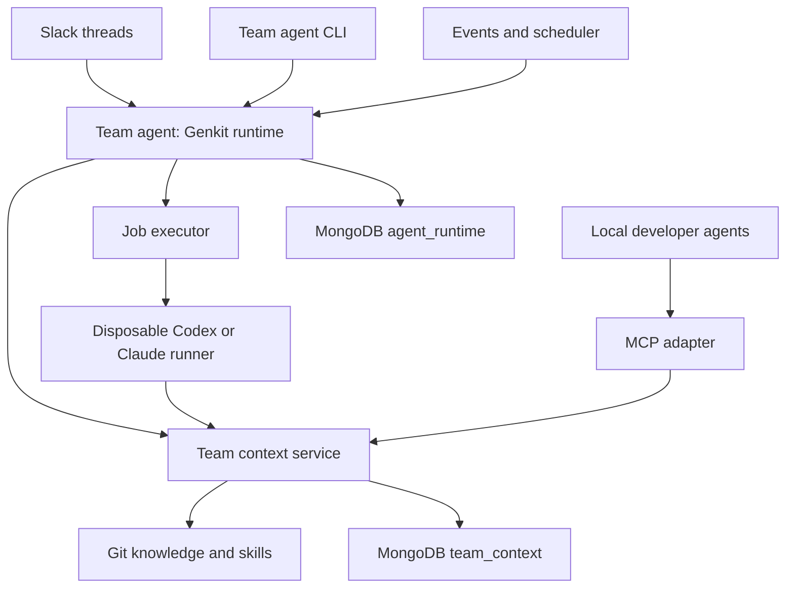

# Team Agent Architecture: Genkit Python Runtime and Portable Extension Kit

Status: Canonical implementation architecture
Updated: 2026-10-05
Audience: Codex and the engineering team

The architectural dogma in `docs/domain-knowledge-authority.md` is normative across every slice.
This deployment serves one small, trusted team and domain. Admission to that project/domain is the
content boundary; admitted developers can use and contribute the complete domain knowledge, skills,
and shared working memory. Do not introduce per-artifact groups or field-level content policy.

### Document precedence

| Document class | Purpose and precedence |
|---|---|
| Domain knowledge authority | Stable dogma; governs every implementation decision. |
| This brief | Single canonical target architecture and implementation sequence. |
| Current workstream brief | Narrows one slice without overriding the dogma or this architecture. |
| `docs/` | Describes behavior implemented now; it is not a second future roadmap. |
| Workstream summaries and `archive/` | Historical evidence and design input; never normative. |

The binding Git-backed skill-distribution decisions are incorporated here. The former addendum,
external architecture review, and superseded ADK brief are archived. Reconcile future conflicts in
this brief before implementation instead of choosing silently between documents.

## 1. Goal and architectural decisions

Build a deployment-neutral, Docker-packaged team agent that supports Slack threads, a CLI, event and scheduled automations, and bounded multi-agent workflows. Use Genkit Python for hosted reasoning and coordination. Preserve a provider-neutral extension kit that local Codex and Claude Code can use independently of Genkit.

The extension kit supplies canonical Git knowledge, reusable skills, supplemental shared memory, and narrow internal tools. Genkit operates hosted agents that consume those capabilities. Disposable coding runners invoke Codex or Claude Code for repository work. Application code owns authorization, durable execution, validation, and publication.

Decisions:

- Python control plane and context service; use uv, a locked dependency set, typing, Ruff, and pytest.
- Genkit Python is the hosted runtime. Keep its types inside a runtime adapter package. Python is preview and the Agents API is beta; verify the installed release before relying on newer agent features.
- Python owns services, orchestration, contracts, and runner supervision. A pinned Codex executable is an external dependency; no TypeScript application service is required.
- The initial coordinator uses the already verified OpenAI Responses model adapter and explicit
  model ID. Coding capability is not a permanent coordinator requirement because repository work
  belongs to the external harness. Gemini and Anthropic remain later provider-contract targets.
  Model agnostic does not mean identical feature behavior.
- MongoDB cluster is the only required durable database. Use separate `agent_runtime` and `team_context` databases and credentials.
- REST is the primary context-service interface; MCP and CLI adapt the same application services.
- Git owns canonical knowledge, conventions, and skills. The context service builds skill discovery
  metadata in memory and distributes immutable packages through authenticated APIs. A protected,
  pinned Git revision becomes canonical only through normal branch/commit/PR/team review. MongoDB
  owns rebuildable knowledge indexes, runtime records, and supplemental shared working memory, not
  the skill catalog or canonical content.
- One deployment maps to one trusted team/domain. Project/domain admission grants use of the whole
  content corpus; record-level access groups and a content-approver role are outside this design.
- Codex is the initial coding harness. Claude Code is a later adapter behind the same contract.
- Produce three images from documented Dockerfile targets: `company/team-agent`, `company/team-context`, and `company/coding-runner`.
- Provide Dockerfiles and development Compose only. Do not add Kubernetes, ECS, Nomad, or production hosting manifests.
- Implement one coordinator first, then a bounded parallel review workflow. Do not introduce an unrestricted agent swarm.

## 2. Service and trust boundaries

| Component | Owns | Must not own |
|---|---|---|
| Team agent | Slack ingress, identities, conversations, Genkit execution, workflow routing, automation definitions and runs | Raw shared-context database access, repository shell execution |
| Team context service | Domain-admitted retrieval, ingestion, skills catalog, shared working memory, internal tools, audit | Canonical content approval, Slack thread state, arbitrary orchestration |
| Coding runner | Pinned checkout, harness invocation, tests, diff/result validation | Long-lived conversation authority, production access |
| Runner supervisor | Credentials, sandbox policy, independent checks, permitted branch/PR publication | Trusting the model's success assertion as verification |
| Job executor | Launch, status, cancel, cleanup | Agent reasoning |



Agent delegation and execution isolation are independent. A Genkit agent or tool delegates to a coding adapter; the executor provisions its environment. Use clear names in code: `GenkitRuntime`, `CodingJobExecutor`, `CodingHarness`, and `CodingRunner`. A model plugin is not a Codex/Claude coding harness.

## 3. Repository layout

This is a conceptual ownership map, not a requirement to create one distribution for every box.
Extend the existing packages and use Python submodules until an independent deployment, dependency,
or ownership boundary proves that another package is useful. Avoid package-consolidation churn as
well as speculative package proliferation.

```text
team-agent/
  apps/
    team_agent/             # HTTP, scheduler, worker entry points
    context_service/        # REST and MCP transports
    coding_runner/          # supervisor and harness adapters
    cli/                    # runtime and context CLI commands
  packages/
    contracts/              # Pydantic contracts and JSON schemas
    auth/                   # identities, domain admission, capability checks
    runtime_genkit/         # generation, model adapters, tools, skill middleware
    workflows/              # bounded workflow definitions and reconciliation
    jobs/                   # executor contracts and local Docker implementation
    automations/            # matching, schedules, leases, cursors
    context_client/         # authenticated REST client
    database/               # MongoDB repositories, validators, indexes
    git_providers/          # provider-neutral contract; GitHub/GitLab adapters later
    observability/
  extension/
    skills/
      diagnose-and-fix/SKILL.md
      review-merge-request/SKILL.md
      architecture-review/SKILL.md
    knowledge/
      architecture/
      domain/
      conventions/
      glossary/
    adapters/
      codex/
      claude/
  tests/
    fixtures/
    integration/
    provider_contracts/
  evals/
  docs/
  Dockerfile
  compose.yaml
  pyproject.toml
  uv.lock
  README.md
```

## 4. Genkit Python integration

Implement a narrow domain interface:

```python
from typing import Protocol

class AgentRuntime(Protocol):
    async def execute(self, request: AgentTurnRequest) -> AgentTurnResult: ...
```

S09 requests contain only run ID, project, objective, and selected skill names. Results contain text,
evidence-derived citations, observable application decisions, usage, exact content revision and skill
lock, failures, and explicit status. Trusted configuration binds identity and environment. S10 may
extend the provider-neutral request with bounded `conversation_context` containing the current
summary and recent turns; the S09 probe continues to omit it. Job metadata stays outside the turn
request. Neither extension introduces Genkit types into domain contracts. Genkit types belong only
in `runtime_genkit`.

S09 exposes a single JSON-in/JSON-out diagnostic and CI probe. It is not an interactive CLI and does
not replace the primary local developer workflow: Codex or Claude with installed project skills and
the team-context MCP/context CLI. Each S09 invocation is stateless, installs selected skills into a
temporary projection, exposes only project-bound read-only knowledge and memory search tools, and
derives citations from observed tool results.

### Framework responsibilities and application responsibilities

| Capability | Genkit contribution | Application code |
|---|---|---|
| Reasoning and model calls | Model plugins, generation, tool loop | Provider configuration and capability tests |
| Conversational coordinator | `ai.generate()` model/tool loop | Bounded history, Slack identity, thread mapping, turn serialization |
| Specialist delegation | Agent calls or tools wrapping specialist flows | Allowed graph, budgets, reconciliation |
| Persistent conversation | Consumes bounded summary and recent turns | MongoDB history, deterministic compaction, local serialization, persisted claims |
| External coding | Tool wrapping a coding-job adapter | Queue, container executor, harness adapter |
| Retrieval | Tools and optional retriever integration | Context service, scope filtering, MongoDB search |
| Automations | Invoked agent/flow | Event matcher, scheduler, leases and idempotency |
| Observability | Flow/model/tool traces and developer UI | Redaction, job/action audit, retention |

Use `ai.generate()` with tools and application-supplied bounded conversation context for the v1
coordinator. Do not configure a Genkit `SessionStore`: the application transcript is authoritative,
and Genkit's store would add snapshot/resume semantics without solving context compaction. Use
`@ai.flow()` for typed specialist operations and explicit workflow stages, and `@ai.tool()` for
narrowly scoped capabilities. Verify exact signatures and imports in the pinned Python release. Do
not translate TypeScript examples mechanically.

Genkit flows are ordinary callable workflow functions with tracing and schemas. Treat the application job store as the authority for cross-process orchestration and recovery. Native detached agent turns, if adopted later, remain separate from container jobs.

Expose these logical tools:

- `search_team_knowledge`, `get_team_document`
- `list_team_skills`, `get_team_skill`
- `search_team_memory`, `create_team_memory`
- `get_incident`, `get_repository_metadata`
- `start_coding_job`, `get_coding_job`, `cancel_coding_job`

Bind caller identity and project/domain admission in trusted application code. A model cannot grant
itself admission or external-action permissions through arguments. Validate arguments and enforce
authorization in the destination service as well.

A Genkit coding specialist can wrap `start_coding_job`, but actual editing and command execution use the Codex/Claude harness in the runner. Do not implement a second homemade repository tool loop in Genkit.

### Python compatibility gate

Before implementing the real runtime, pin a Python version, Genkit release, provider plugins, and harness versions in `uv.lock` and image build inputs. Document the tested matrix in `docs/compatibility.md`.

Verify agent creation, tool calls, structured output, streaming, sessions, custom store hooks, abort
behavior, and FastAPI integration against executable examples. Session and custom-store checks are
compatibility evidence, not the selected production persistence design. Check specialist delegation
in Python explicitly: availability in TypeScript or Go is not evidence of Python parity.

If delegation middleware is unavailable, expose specialists as Genkit tools backed by flows. Use an explicit Python workflow state machine for fixed order, parallel branches, and joins. If the agent API fails required tests, implement the same `AgentRuntime` interface with Genkit flows/`generate()` and application-owned history. Keep Genkit and Python; record the fallback. Do not introduce a TypeScript service, LangGraph, or another orchestrator without a concrete need.

### Model providers

Use a configuration-driven model factory. Support OpenAI first through the verified Responses
adapter and one explicit API model ID. The compatibility gate selects and records the exact tested
ID; it does not make coding-oriented reasoning a permanent coordinator constraint. Keep Anthropic
and Gemini configurations extensible. Use provider plugins supported by the installed Python
release; a thin custom model adapter is permissible if documented and tested. Do not route through
LiteLLM by default.

The OpenAI model plugin and `CodexHarness` are different adapters. The former performs hosted
coordinator reasoning through Genkit. The latter invokes the pinned Codex executable inside a
disposable coding container. Neither may substitute for the other's trust boundary.

Opus and Sol are compatibility targets, not API identifiers or guarantees of feature parity. Configure exact API model IDs and endpoints. Do not silently discard reasoning parameters, change models, or fall back to a different provider.

Provider contract tests cover multi-step tools, structured output with tools, streamed arguments when used, conversation continuation, reasoning continuity where required, usage accounting, and failure reporting. CI uses synthetic fixtures; credential-dependent tests are opt-in and bounded.

### Skills and context

Canonical skills remain Git-owned and provider neutral. The context service scans validated packages
from one protected, pinned checkout into an in-memory discovery catalog; MongoDB is not required for
skill discovery or download. Every developer admitted to the deployment's project/domain can use and
contribute the complete domain catalog. Each package includes trigger metadata, prerequisites,
procedure, constraints, evidence requirements, completion criteria, and a complete resource
inventory. V1 skill packages are self-contained and do not declare skill-to-skill dependencies.

The shared Python `SkillClient` resolves domain admission and named/all selections to a versioned
manifest pinned to one immutable catalog revision. The `SkillInstaller` validates safe paths and
hashes, writes a snake_case lock and ownership manifest, and atomically creates a bounded per-run
projection. The service exposes only the current canonical catalog revision; runners stage verified
packages during bootstrap for the job lifetime, and old frozen locks require a verified cache or
fail without fallback. Genkit points `genkit_middleware.Skills` only at that projection. Never point
middleware at the complete extension tree or let `use_skill` bypass context-service authorization.
If middleware cannot preserve these invariants, retain the same resolved-lock contract and render
selected skills into trusted task instructions instead. Repository review—not a context-service
operation—is what makes a skill change canonical.

Project development also uses the checked-in `developing-genkit-python` agent skill installed from
`genkit-ai/skills`. That skill guides contributors writing Genkit code; it is not part of the hosted
runtime's team-skill catalog and grants no application capability.

Advertise relevant domain metadata first; load full skill bodies/resources on demand and record
the resolved lock on each run. The `team-agent skills pull` interface installs named, domain-all,
or frozen-lock selections without executing downloaded scripts. Use project-scoped generic, Codex,
and Claude adapters; required runner installation completes before harness launch. Script execution,
when explicitly authorized later, happens only in coding containers and never during installation.

Add a compact domain baseline to each turn: scope, essential conventions, and selected shared
working memory clearly labeled supplemental. Retrieve additional knowledge through tools, preserving
citations and distinguishing canonical Git content, supplemental memory, and trusted application
instructions. Canonical Git content wins any conflict. Cap context size.

## 5. Sessions, history, and shared memory

One Slack thread maps to one conversation under a unique `(workspace_id, channel_id, thread_ts)`
key. V1 runs one active coordinator-worker process. It may process different conversations
concurrently but serializes turns for the same conversation with a process-local lock. Follow-ups
continue the conversation when earlier work submitted jobs or requested clarification.

Keep one application-owned conversation history as ordered turns plus a bounded deterministic
summary. Each model call receives only that summary and a bounded window of recent completed turns;
never read or replay the complete transcript. MongoDB compare-and-set updates and the minimal claim
fields `active_turn_id`, `claim_generation`, and `claim_expires_at` recover abandoned work and reject
stale completions after a restart. V1 has no renewable conversation lease, owner registry, or opaque
lease token. Each turn records its exact Git content revision and skill lock. Later turns may use
newer canonical knowledge, while a coding job pins one exact revision for its lifetime. Do not build
snapshot ancestry, conversation branching, Genkit `SessionStore` persistence, or a second
framework-owned authoritative transcript in v1.

Keep three concepts separate:

1. Conversation history and Genkit state: `agent_runtime`.
2. Workflow and external action progress: `agent_runtime`.
3. Shared team working memory: `team_context`, accessed through the context service.

Shared working memory has project/domain scope, provenance, evidence, author, timestamps, revision,
expiration, and supersession. It is immediately available to every admitted developer and remains
supplemental and non-canonical throughout its lifecycle. Every admitted developer can create,
search, revise, supersede, and expire it; there is no per-memory audience or approver role. A useful
record becomes canonical only by becoming a reviewed Git change. Model confidence and application
operations cannot promote it.

## 6. Portable extension kit and RAG

Keep local Codex/Claude configuration project scoped. Do not globally expose company tools in unrelated personal repositories. Local agents access MCP or the context CLI without needing Genkit or database credentials.

Context REST endpoints:

```text
POST /v1/knowledge/search
GET  /v1/documents/{id}
GET  /v1/skills
GET  /v1/skills/{name}
POST /v1/skills:resolve
GET  /v1/skill-packages/{package_id}
POST /v1/memories/search
POST /v1/memories
PUT  /v1/memories/{id}
POST /v1/memories/{id}/expire
GET  /v1/memories/{id}/audit
POST /v1/tools/{tool-name}:invoke
GET  /health
GET  /ready
```

MCP exposes search plus additive shared-memory creation; it does not expose update, expiry, audit, or
publication operations. The hosted runtime uses scoped REST-backed function tools initially; a
verified Python MCP client integration may be added later without duplicating business logic. Do
not assume Genkit's developer MCP server is the runtime context server.

Ingestion reads canonical sources at one exact protected Git revision, normalizes and chunks them,
attaches project/domain provenance, and stages a complete revision-scoped projection. Publication
verifies the candidate and atomically advances an active-revision pointer; retrieval never mixes
revisions. Retrieval verifies project/domain admission before returning content, uses bounded
lexical scoring as the v1 baseline, and returns citations. Add embeddings, vector search, or
reranking only when retrieval evals demonstrate misses that justify them. Implement the
platform-neutral CI and reconciliation contract in `docs/required-ci-implementations.md`. Preserve
a `KnowledgeService` interface if the cluster requires another search implementation.

Each returned chunk includes source ID, repository/path, exact commit revision, owner, project/domain,
projection build metadata, update timestamp, and citation reference. MongoDB chunks are rebuildable
representations, not an independent authority. Treat repository content and retrieved documents as
untrusted input rather than tool authorization.

## 7. Durable run and action execution

Team-agent process modes:

```text
team-agent serve
team-agent scheduler
team-agent worker
```

Ingress verifies Slack signatures, deduplicates events, acknowledges promptly, and enqueues work. The scheduler claims due occurrences. Workers claim runs with renewable leases. These modes may share a development process but must not require co-location.

Run states: `queued`, `running`, `waiting_for_jobs`, `needs_input`, `completed`, `failed`, `cancelled`, `timed_out`.

Core v1 persists explicit transitions on `runs` and `coding_jobs`; do not introduce a generalized
step/action/outbox framework without a demonstrated crash boundary. Native agent background execution
is optional; required recovery works from application records. Reconcile submitted jobs and remote
publications rather than blindly replaying them. Use idempotency keys for job submission, review
publication, branch/PR creation, and Slack reactions. A network timeout may mean an action succeeded
remotely; query its status before retrying. Do not claim exactly-once delivery; provide effectively-once
visible outcomes through deduplication and reconciliation.

A coding-job submission returns a job ID promptly. Suspend the logical run, let workers track completion, and invoke the coordinator with a structured result when ready. Do not hold an HTTP request open for a 30-minute coding task or poll indefinitely inside the model loop.

Genkit agent/tool calls handle reasoning and delegation; explicit Python workflow code defines mandatory order and joins. Neither replaces durable queues, scheduler leases, action records, or restart recovery.

## 8. Bounded multi-agent workflows

Start with one coordinator. Specialist agents are introduced only for an explicit workflow; each has a purpose, context budget, allowed tools, and structured output. Cap agent count, depth, model turns, total spend, time, and job concurrency. No recursive self-spawning.

### Specialist roles

Use a coordinator for task routing, an optional domain specialist for cited knowledge, external coding specialists for repository operations, and a review reconciler for evidence synthesis. Each native specialist can have its own model configuration, prompt, and tools. Do not create a specialist when one tool suffices.

Invoke fixed workflow branches through application code; use bounded asyncio concurrency for short in-process operations and durable child jobs for repository work. An in-memory asyncio task is not a recoverable job. Store branch completion and the join decision before continuing.

### Diagnose and fix

1. Coordinator retrieves incident details and relevant knowledge; loads `diagnose-and-fix`.
2. If needed, submit a pinned repository investigation/fix job.
3. Coding harness diagnoses, edits, and tests in the disposable workspace.
4. Supervisor independently validates the diff and mandatory checks.
5. Where authorized, publish a draft PR and return evidence to the Slack thread.
6. Record useful lessons as supplemental working memory and, when durable value warrants it,
   prepare a Git change for normal team review.

### Parallel merge-request review

Implement a fixed graph with these steps:

1. Resolve repository, base SHA, and head SHA; freeze the review target.
2. Retrieve relevant conventions and authorized domain context.
3. Launch at most two independent reviewers: correctness and security. Use separate coding jobs/workspaces with edits disabled. Review roles may use Codex or Claude through the harness interface; two different providers are not required initially.
4. Collect structured findings. Reconcile duplicates, unsupported assertions, conflicts, and severity; preserve each finding's evidence and attribution.
5. Validate target revision and findings before publication. If the head changed, mark results stale and schedule the new revision; do not publish as if the old review covers the new head.
6. Publish one consolidated review, then project completion to Slack.

The reconciler can be a Genkit specialist, but deterministic code enforces publication gates. Reviewer failures produce an explicit partial/failed result; never label an incomplete required review completed. Completion means review finished, not that the code is approved. Configure findings/status separately from completion reactions.

For future parallel edits, give each job an isolated checkout and branch. An explicit integration job resolves patches and reruns checks. Do not have multiple writers edit the same checkout or push the same branch.

## 9. Coding agent adapters and disposable execution

```python
class CodingHarness(Protocol):
    async def execute(self, context: CodingContext) -> HarnessResult: ...

class CodingJobExecutor(Protocol):
    async def start(self, request: CodingJobRequest) -> JobHandle: ...
    async def status(self, job_id: str) -> JobStatus: ...
    async def cancel(self, job_id: str) -> None: ...
    async def result(self, job_id: str) -> CodingJobResult: ...
```

Implement `LocalDockerExecutor`, `MockCodingHarness`, and then `CodexHarness`. Add `ClaudeHarness` after the first real path passes acceptance tests.

- Codex: Python invokes the pinned supported noninteractive CLI using an async subprocess and structured event output. Its documented TypeScript SDK wraps that CLI; do not invent a Python Codex SDK or add a Node service solely to use the wrapper.
- Claude: invoke the official Python Claude Agent SDK and consume its result/progress stream. Configure project settings, permissions, MCP, and session loading explicitly against the installed version.
- Normalize both into the same domain contracts. Harness sessions and Genkit sessions are separate; save their mapping and versioned session artifacts.

SDK invocation and container isolation coexist: invoke the SDK/CLI inside the coding container. A direct provider model call is not the corresponding coding harness.

### Container lifecycle

The coordinator, scheduler, and executor worker are persistent processes. One coding job receives one fresh container from a reusable image and one checkout pinned to its requested revisions. Build the image ahead of time; do not rebuild it for every task.

A job can contain many model turns, edits, commands, and test runs. Do not create a container per model call, tool call, or Slack message. A parallel review creates one job/container for each independent reviewer.

The executor creates the container using the persisted job ID as a stable label, mounts job-specific input/output locations, applies policy, starts it, captures progress, and stores artifacts before cleanup. Reconcile Docker labels after a worker restart. A crash between creation and recording must recover the existing container, not launch a duplicate.

Default to removing a terminal container once artifacts are durably saved. Follow-ups create a fresh job restored from the saved commit/patch and compatible harness session data. Optional short retention of an active task environment can be configured later, with an idle deadline; it is not required for Slack conversation continuity.

Cache downloads/dependencies only through scoped, controlled caches. Do not share writable checkouts, credentials, or harness settings between jobs. Define `ExecutionEnvironment` behind the executor so another sandbox/VM provider or a development-only persistent worker can be added without coordinator changes.

### Completion and resume

The harness adapter detects a terminal SDK result or CLI turn event and process outcome, then validates its structured output. Turn completion alone is not job success. The supervisor independently checks the resulting diff and required tests.

The executor commits terminal job state and a completion notification to MongoDB atomically (or
through an idempotent outbox protocol). A run worker consumes that notification, enters the same
per-conversation serialization path as a user turn, and invokes Genkit with the validated result.
MongoDB polling is the required portable baseline; change streams are optional when the deployment
supports them.

Deduplicate notifications by job/attempt/result version. Enforce deadlines and cancellation through the executor, and terminate remaining subprocesses. Persist incremental progress for CLI/Slack status without sending every token to Slack.

If a result requires input or authorization, save a resumable checkpoint and transition the logical run accordingly. Persist artifacts before destroying its workspace. Retrying a job uses a new attempt and does not republish an already completed external action.

Every request/result is schema-validated and versioned. A request includes `job_id`, `run_id`,
submission idempotency key, repository, base/head revisions, objective, mode (`investigate`, `fix`,
`review`, `integrate`), harness, an immutable skill lock, pinned content revision, context references,
and supervisor-owned capability policy. Policies include allowed repositories/paths/commands,
may-edit/publish flags, timeout, diff limits, and resource limits.

Results include terminal status, diagnosis, evidence, findings, patch reference, changed files,
harness-reported checks, independent verification, exact reviewed SHA, publication outcome, usage,
and supplemental working-memory suggestions. Findings include severity, path/line reference,
explanation, evidence, and suggested action.

Job lifecycle states are `completed`, `failed`, `timed_out`, `cancelled`, and `needs_input`.
Domain results such as `fixed`, `no_fix_found`, or `unsafe_to_proceed` belong in a separate outcome
field; a successfully completed investigation is not a failed lifecycle merely because no safe fix
exists.

The supervisor creates an ephemeral workspace, checks out exact revisions, configures project instructions and the extension, grants scoped credentials, launches the harness, validates output/diff, executes mandatory checks, and performs authorized publication. Keep Git write credentials out of model context and harness environment. Verification must use an execution environment with no publication credentials; repository tests are arbitrary code.

## 10. Automations

Event-triggered and scheduled definitions create the same workflow runs as manual requests. Deterministically parse and allowlist MR URLs; do not ask a model to decide whether a URL is an authorized repository.

Automation definitions select named skills and may require a catalog revision. Resolve that
selection when creating a workflow run and persist the immutable lock. Same-job retries reuse staged
packages. A new job may satisfy an old lock from a verified cache; otherwise unavailable exact
packages fail rather than substituting a newer deployment. The automation service uses the shared
Python resolver, and runner bootstrap consumes the same frozen lock.

Support the original use cases:

- A new message in a configured Slack channel linking an MR triggers a review and completion reaction after publication succeeds.
- Every six hours, scan a bounded channel window and reconcile unreviewed revisions or missing reactions.

Logical review identity:

```text
automation_id + slack_message_id + merge_request_id + head_sha
```

Use this for message-specific dispatch/projection. The optional event-review slice may also maintain
a canonical review key `(workflow_version, repository, merge_request_id, head_sha)` to reuse an
equivalent exact-revision review across duplicate messages.

Unique scheduled occurrence key: `(automation_id, scheduled_occurrence)`. Atomically claim due definitions, create occurrences, track child runs, and advance scheduling state without losing work on crash. Use transactions where necessary, or a documented idempotent recovery protocol. Store timezone, schedule expression, next-run timestamp, cursor, enabled state, creator, policy, budgets, and concurrency limits.

Emoji is a projection, not the authority. Internal review records establish completion for an exact SHA. Reconciliation repairs missing reactions without rerunning completed reviews. A new SHA gets a new review. Cursor advancement must retain failed/deferred targets in a durable retry ledger. Use bounded backoff and inspectable exhausted failures.

## 11. MongoDB collections and indexes

`agent_runtime` core v1: identities, slack_threads, conversations, conversation_turns, runs,
coding_jobs, event_receipts, code_reviews, publication_records. Optional automation slices may add
automations, automation_runs, and review_projections when their behavior is implemented.

`team_context`: knowledge_documents, knowledge_chunks, knowledge_revisions,
active_knowledge_revisions, shared_memories, shared_memory_idempotency,
shared_memory_audit_events, schema_migrations.

Skill packages and discovery metadata are rebuildable from Git and are not MongoDB collections.
Runtime and automation records retain only the selected identities, immutable revisions, and hashes
needed for provenance and retry.

Only the context service accesses `team_context`. Local agents receive no MongoDB credentials. Use collection validators and explicit schema migrations.

Required core indexes cover Slack thread identity, Slack event receipt ID, ordered conversation
turns, conversation request idempotency and claim expiry, coding submission, publication
idempotency, exact review target, and context scope/source revision. Optional automation slices add
occurrence and projection keys. Apply TTL only
to disposable receipts or expired data with a defined retention policy, not authoritative completion
records needed for deduplication.

Avoid embedding unbounded events, logs, or findings in one document. Keep large patches/logs out of model prompts; use bounded extracts and artifact references. Local dev may use a Docker volume for artifacts; define an artifact-store interface for other environments.

## 12. Authorization and operational controls

Authenticate humans and services, map identities to project/domain admission, and reject content
retrieval before results are materialized when admission is absent. Admitted developers share the
complete domain corpus. Enforce tools and workflows outside prompts. An explicit developer request
or configured automation authorizes its bounded branch, draft-PR, or review publication. Do not add
an internal approval subsystem. Merge, deploy, production mutation, and data migration remain
disabled in the initial release.

Do not mount a Docker socket into Slack ingress or the coordinator in production. Run the local Docker executor in a separate trusted worker process; make the boundary explicit in Compose and docs. Containers run non-root, use ephemeral workspaces, have resource/time limits, and emit structured logs. Network isolation is enforced by the executor/platform, not by prompt text.

Record correlations across event, conversation, workflow, agent invocation, coding job, reviewed commit, publication, and reaction. Redact secrets and sensitive incident fields. Configure tracing/export deliberately; avoid sending full internal payloads to external telemetry by default.

## 13. Configuration

Use service-specific environment variables for MongoDB credentials/database, context URL, Slack secrets, process mode, model provider/ID/endpoint, content revision/path, embedding provider, executor, harness, retention, budgets, and telemetry. Keep coordinator credentials separate from coding-harness credentials. Never assume a ChatGPT/Claude subscription supplies API credentials or rights for unattended service use.

Provide `.env.example` with placeholders and safe mock mode. Default local demos to fake Slack, mock model/runtime, fixture knowledge, and mock Git publication. Real model/harness/Git operations are explicitly configured. Docker Compose may run a single-node MongoDB replica set if chosen transactions require it.

## 14. Implementation sequence and acceptance

### Phase 0 — Python compatibility spike

Verify the pinned Genkit Python APIs and the OpenAI adapter using a small executable sample. Select
and record one exact initial OpenAI API model ID. Validate tool calls, structured outputs,
streaming, conversation continuation, custom session persistence as compatibility evidence, Skills
middleware, abort behavior,
FastAPI integration, and available specialist delegation. Record feature support and choose Agents
API or flows fallback. Keep live API checks opt-in; deterministic fakes must let later application
work proceed without credentials. Test the actual Codex noninteractive command and Claude Python SDK
interface when installed.

Exit: a checked-in compatibility matrix and runnable sample establish supported imports, signatures,
the configured OpenAI model ID, and the authorized skill-loading path. Missing credentials are
documented; mocks allow application work to proceed without claiming live compatibility.

### Phase 1 — Foundation and extension

Create the Python workspace, contracts, mock clients, MongoDB knowledge repositories/indexes,
context REST service, development Compose, image targets, and fixture knowledge/skills. Implement
authenticated cited retrieval, the Git-backed in-memory skill catalog, immutable package resolution,
verified pull/lock installation, shared working memory, MCP/context CLI, and project-scoped local-agent
adapters.

Exit: all image targets build; REST/MCP/CLI retrieval agrees; targeted/all/frozen pulls are atomic
and reproducible; Codex/Claude project layouts pass discovery fixtures; non-admitted callers receive
no domain content; every admitted developer can use the complete knowledge/skills/memory corpus;
knowledge revisions, skill locks, and working-memory provenance are preserved.

### Phase 2 — Genkit coordinator and conversations

Implement the model factory, Genkit adapter consuming the shared skill resolver/installer, the S09
stateless diagnostic/CI JSON probe, then application-owned ordered conversations with bounded
summaries. Use deterministic runtime fixtures in CI, then validate one live provider when credentials
exist.

Exit: skill-guided retrieval works; bounded multi-turn state survives restart; concurrent
same-conversation turns are serialized inside the one-worker deployment; abandoned claims recover
without accepting a stale completion; live-provider limitations are documented without silent
parameter dropping.

### Phase 3 — Coding vertical slice

Implement leased runs/jobs, immutable skill locks as job inputs, frozen runner-bootstrap installation,
local Docker executor, mock then real Codex harness, independent checks, cancellation/timeouts, and
mock draft PR publication.

Exit: `diagnose-and-fix` fixes a fixture idempotency defect using a retrieved ADR, passes its regression test and supervisor checks, and returns a structured draft PR result. A crash after submission does not create a duplicate job or publication.

### Phase 4 — Core Slack integration

Add signed Slack ingress, identity/thread mapping, asynchronous replies, URL validation, and the
end-to-end Slack-to-Codex workflow. Event automation, scheduling, reconciliation, cursors, and
reaction projections are optional S17–S18 expansions.

Exit: duplicate Slack events produce one visible result; thread follow-ups survive restart; the
fixture coding workflow reports progress and one mock publication outcome.

### Phase 5 — Optional automation and parallel review

Optionally implement event review, scheduled reconciliation, and two-role parallel review with
separate read-only workspaces and a maximum of two jobs per review. Add global/per-automation caps.
Preserve the core sequential option.

Exit: duplicate/conflicting findings are reconciled with evidence; stale heads and missing required reviewers block successful publication; result attribution and budgets are visible; restarting resumes/reconciles steps rather than repeating side effects.

### Phase 6 — Real integrations and hardening

Implement configured Git provider publication, credential rotation, injection/failure evals,
operational recovery docs, and the S24 team/domain CI adoption guide. Keep deployment neutral and
the CI publication contract platform agnostic. Additional providers, the Claude harness, scheduled
automation, and parallel review are optional expansions rather than v1 gates.

Exit: end-to-end fixture and failure suites pass; real publication uses supervisor credentials only; no merge/deploy/production capability is exposed; local extension remains usable without Genkit.

## 15. Required verification

Use meaningful unit/integration tests for domain admission, complete-corpus visibility, Git-over-memory
precedence, working-memory lifecycle, conversation persistence/claims, Slack deduplication,
publication reconciliation, skill selection, stale-head review, cancellation, diff rejection,
credential separation, and provider translation. Optional automation and parallel-review slices add
event/occurrence deduplication and partial-reviewer failure checks. Include prompt-injection fixtures
in retrieved knowledge and repository files.

Workflow evals assess grounded answers, valid evidence, useful diagnosis, unsupported findings, and skill relevance. Each initial skill has positive and negative trigger cases. Do not treat two agreeing model reviewers as proof of correctness; require evidence and independent executable checks where applicable.

CI uses mocks and fixture repositories without external credentials. Live provider/harness suites are opt-in and bounded by spend/time. Document what was verified versus stubbed or unavailable.

## 16. Official implementation references

Checked against current documentation on 2026-10-03. Pin and verify actual package releases before coding; documentation may describe capabilities newer than an installed package. Python is marked preview and Agents API is beta.

- Python overview: https://genkit.dev/docs/python/overview/
- Python agents: https://genkit.dev/docs/python/agents/overview/
- Agent definitions: https://genkit.dev/docs/python/agents/define/
- Session stores and custom contract: https://genkit.dev/docs/python/agents/session-stores/
- Python flows: https://genkit.dev/docs/python/flows/
- Python tools: https://genkit.dev/docs/python/tool-calling/
- Python Anthropic plugin: https://genkit.dev/docs/python/integrations/anthropic/
- Python OpenAI plugin: https://genkit.dev/docs/python/integrations/openai/
- Python API reference: https://python.api.genkit.dev/
- Multi-agent pattern reference: https://genkit.dev/docs/agents/multi-agent/ (verify language-specific support)
- Codex noninteractive execution: https://developers.openai.com/codex/noninteractive/
- Codex SDK source (TypeScript, reference only): https://github.com/openai/codex/tree/main/sdk/typescript
- Claude Agent SDK: https://code.claude.com/docs/en/agent-sdk/overview

## 17. Execution status

Use `ROADMAP.md` for dependency order and `workstreams/STATUS.md` for the current slice and required
technical check-in. This brief defines the target architecture; it does not restart completed phases
or override as-built documentation and verified workstream summaries.
