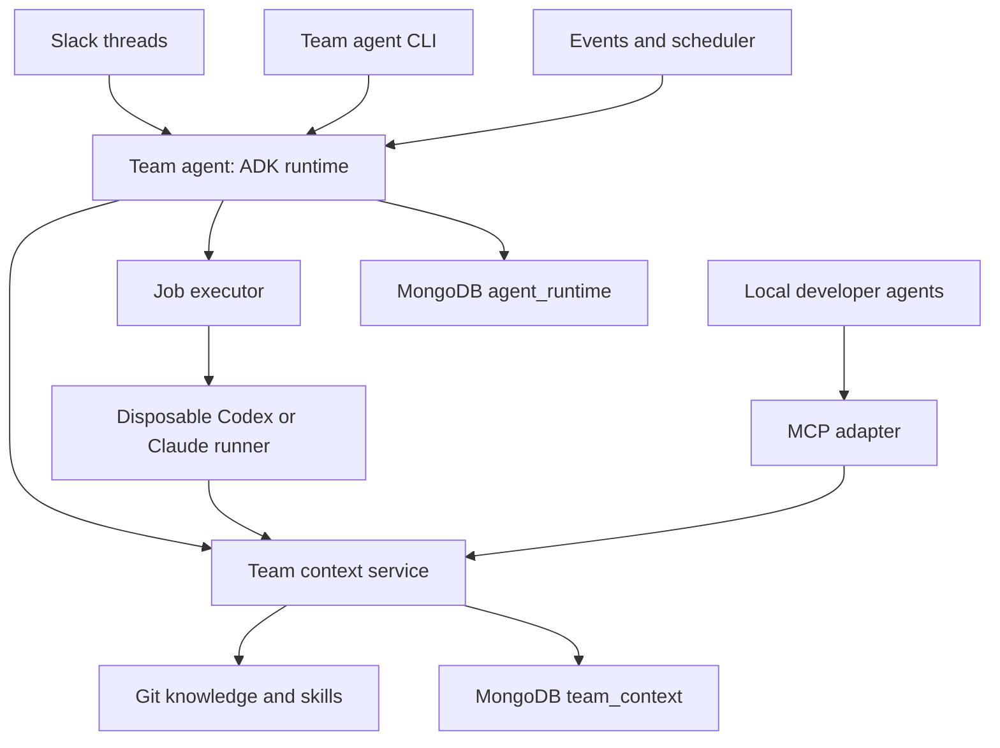

# Team Agent Architecture: Google ADK Runtime and Portable Extension Kit

Status: Superseded by `.roadmap/team-agent-architecture-brief-genkit.md`; retained as the ADK
planning record only
Updated: 2026-10-03
Audience: Codex and the engineering team

## 1. Goal and architectural decisions

Build a deployment-neutral, Docker-packaged team agent that supports Slack threads, a CLI, event and scheduled automations, and bounded multi-agent workflows. Use Google Agent Development Kit (ADK) for hosted reasoning and coordination. Preserve a provider-neutral extension kit that local Codex and Claude Code can use independently of ADK.

The extension kit supplies approved knowledge, reusable skills, persistent scoped memory, and narrow internal tools. ADK operates hosted agents that consume those capabilities. Disposable coding runners invoke Codex or Claude Code for repository work. Application code owns authorization, durable execution, validation, and publication.

Decisions:

- Python control plane and context service; use uv, a locked dependency set, typing, Ruff, and pytest.
- Google ADK is the hosted runtime. Keep its types inside a runtime adapter package.
- Coordinator model is configurable. Gemini, Anthropic, and OpenAI model integrations may differ in capability; model agnostic does not mean identical feature behavior.
- MongoDB cluster is the only required durable database. Use separate `agent_runtime` and `team_context` databases and credentials.
- REST is the primary context-service interface; MCP and CLI adapt the same application services.
- Git owns canonical knowledge, conventions, and skills. Skill discovery is rebuilt in memory and
  immutable packages are distributed through the context service. MongoDB owns knowledge indexes,
  runtime records, and dynamic memory, not the skill catalog.
- Codex is the initial coding harness. Claude Code is a later adapter behind the same contract.
- Produce three images from a multi-stage Dockerfile: `company/team-agent`, `company/team-context`, and `company/coding-runner`.
- Provide Dockerfiles and development Compose only. Do not add Kubernetes, ECS, Nomad, or production hosting manifests.
- Implement one coordinator first, then a bounded parallel review workflow. Do not introduce an unrestricted agent swarm.

## 2. Service and trust boundaries

| Component | Owns | Must not own |
|---|---|---|
| Team agent | Slack ingress, identities, conversations, ADK execution, workflow routing, automation definitions and runs | Raw shared-context database access, repository shell execution |
| Team context service | Authorized retrieval, ingestion, skills catalog, shared memory, internal tools, audit | Slack thread state, arbitrary orchestration |
| Coding runner | Pinned checkout, harness invocation, tests, diff/result validation | Long-lived conversation authority, production access |
| Runner supervisor | Credentials, sandbox policy, independent checks, permitted branch/PR publication | Trusting the model's success assertion as verification |
| Job executor | Launch, status, cancel, cleanup | Agent reasoning |



ADK's `Runner` is the in-process agent execution engine. It is distinct from the disposable coding runner container. Use clear names in code: `AdkRuntime`, `CodingJobExecutor`, and `CodingRunner`.

## 3. Repository layout

```text
team-agent/
  apps/
    team_agent/             # HTTP, scheduler, worker entry points
    context_service/        # REST and MCP transports
    coding_runner/          # supervisor and harness adapters
    cli/                    # runtime and context CLI commands
  packages/
    contracts/              # Pydantic contracts and JSON schemas
    auth/                   # identities, scopes, policy decisions
    runtime_adk/            # agents, model adapters, ADK session adapter
    workflows/              # bounded workflow definitions and reconciliation
    jobs/                   # executor contracts and local Docker implementation
    automations/            # matching, schedules, leases, cursors
    context_client/         # authenticated REST client
    database/               # MongoDB repositories, validators, indexes
    git_providers/          # mock first; GitHub/GitLab adapters later
    observability/
  extension/
    skills/
      diagnose-and-fix/SKILL.md
      review-merge-request/SKILL.md
      architecture-review/SKILL.md
    knowledge/
      architecture/
      domain/
      conventions/
      glossary/
    adapters/
      codex/
      claude/
  tests/
    fixtures/
    integration/
    provider_contracts/
  evals/
  docs/
  Dockerfile
  compose.yaml
  pyproject.toml
  uv.lock
  README.md
```

## 4. ADK integration

Implement a narrow domain interface:

```python
class AgentRuntime(Protocol):
    async def execute(self, request: AgentTurnRequest) -> AgentTurnResult: ...
```

Requests include run ID, authenticated principal reference, conversation ID, objective,
project/repository scope, context references, an immutable selected-skill lock, and capability policy.
Results include text, citations, structured decisions, usage, pending external jobs, and explicit
status. Never serialize provider-specific state into public contracts without an opaque, versioned
envelope.

`AdkRuntime` composes an `LlmAgent`, an ADK `Runner`, scoped function tools, skills, session services, and callbacks/plugins. Support these logical tools:

- `search_team_knowledge`, `get_team_document`
- `list_team_skills`, `get_team_skill`
- `search_team_memory`, `propose_team_memory`
- `get_incident`, `get_repository_metadata`
- `start_coding_job`, `get_coding_job`, `cancel_coding_job`

Bind caller identity and allowed scope in trusted application code. The model cannot grant itself permissions by passing a user ID, repository, or policy object. Validate all arguments and enforce authorization in the destination service as well.

### Model providers

Use a configuration-driven model factory. Support one live coordinator provider initially, while keeping the factory extensible. Select the first provider from available credentials; do not invent an API model ID from a product nickname. Document exact model ID, endpoint, adapter, and pinned versions used.

Opus and Sol are desired compatibility targets, not a promise of feature parity. ADK's Python LiteLLM path is one option; use another supported adapter when it better satisfies the required behavior. Verify current official APIs before implementing. Do not silently discard unsupported reasoning settings or fall back to a different provider.

Implement a provider contract suite that checks multi-step tool calls, streamed tool arguments when enabled, structured outputs combined with tools, conversation replay, thinking/reasoning continuity where supported, skill loading, and failure reporting. Keep live credential-dependent tests opt-in and use recorded/synthetic fixtures in ordinary CI. Record known limitations and chosen workarounds.

### Skills

Canonical skill packages remain Git-owned and provider neutral. The context service scans a pinned
checkout into memory, resolves authorized selections to immutable manifests, and serves complete
hashed packages. The shared Python client/installer writes a frozen lock and bounded project
projection for ADK or a coding harness. ADK's experimental types must not leak into these contracts.

Advertise only authorized/relevant skill metadata; load full bodies and resources on demand. Record the revision used for a run. Keep discovery and resource reading separate from script execution. Scripts requiring repository access execute inside coding runners. Do not enable general script execution in the hosted coordinator merely because a skill contains scripts.

Skill prose guides behavior; tools and supervisors enforce permissions and completion gates. Native ADK skill loading can be replaced by context-service skill tools without changing canonical content.

### Context injection

Use callbacks/plugins or an equivalent supported ADK hook to add a compact, authorized baseline: task scope, essential conventions, and selected approved memories. Use tools for additional RAG retrieval. Preserve source attribution, distinguish retrieved facts from instructions, and cap context size. Do not inject the entire knowledge base into every turn.

## 5. Sessions, history, and shared memory

One Slack thread maps to one conversation under a unique `(workspace_id, channel_id, thread_ts)` key. Serialize turns for a conversation across worker replicas. Follow-ups continue the conversation even when previous work created coding jobs or requested clarification.

Implement `MongoSessionService` against the installed ADK session-service contract. ADK's documented relational `DatabaseSessionService` is not a MongoDB adapter. Cover session create/get/list/delete, event append, state deltas, app/user/session state semantics used by the runtime, pagination, and consistent ordering. Persist schema and adapter versions. Avoid one unbounded MongoDB document for all history; use separate session metadata and event records with unique event IDs and ordered sequence numbers.

Use a lease plus fencing token or equivalent compare-and-set guard to prevent stale workers from appending turns after ownership changes. Session persistence does not itself resume a partially completed external action. Job and action records provide recovery.

Keep three concepts separate:

1. Conversation history and ADK state: `agent_runtime`.
2. Workflow and external action progress: `agent_runtime`.
3. Shared team memory: `team_context`, accessed only through the context service.

Memories have scope, provenance, evidence, author, timestamps, authority, expiration, and supersession. New team memories start as proposals. Approving them is an authorized application operation; no automatic promotion based on model confidence.

## 6. Portable extension kit and RAG

Keep local Codex/Claude configuration project scoped. Do not globally expose company tools in unrelated personal repositories. Local agents access MCP or the context CLI without needing ADK or database credentials.

Context REST endpoints:

```text
POST /v1/knowledge/search
GET  /v1/documents/{id}
GET  /v1/skills
GET  /v1/skills/{name}
POST /v1/skills:resolve
GET  /v1/skill-packages/{package_id}
POST /v1/memories/search
POST /v1/memory-proposals
POST /v1/memory-proposals/{id}/approve
POST /v1/tools/{tool-name}:invoke
GET  /health
GET  /ready
```

MCP exposes the same narrow operations. The hosted runtime uses scoped REST-backed function tools initially; MCP can be connected through ADK `McpToolset` without duplicating business logic.

Ingestion reads approved sources at pinned Git revisions, normalizes and chunks them, attaches authorization and provenance, generates embeddings, and records revision/index status. Retrieval applies access filters before returning content, combines lexical and vector results, optionally reranks, prefers approved/current sources, and returns citations. Use MongoDB Search and Vector Search where supported. Preserve a `KnowledgeService` interface if the cluster requires another search implementation.

Each returned chunk includes source ID, repository/path, revision, authority, owner, project/access groups, update timestamp, and citation reference. Treat repository content and retrieved documents as untrusted input rather than tool authorization.

## 7. Durable run and action execution

Team-agent process modes:

```text
team-agent serve
team-agent scheduler
team-agent worker
```

Ingress verifies Slack signatures, deduplicates events, acknowledges promptly, and enqueues work. The scheduler claims due occurrences. Workers claim runs with renewable leases. These modes may share a development process but must not require co-location.

Run states: `queued`, `running`, `waiting_for_jobs`, `needs_input`, `awaiting_approval`, `completed`, `failed`, `cancelled`, `timed_out`.

Persist step transitions and external action intents before invocation. Recovery reconciles submitted actions with executor/provider state rather than blindly replaying tool calls. Use idempotency keys for job submission, review publication, branch/PR creation, and Slack reactions. A network timeout may mean an action succeeded remotely; query its status before retrying. Do not claim exactly-once delivery; provide effectively-once visible outcomes through deduplication and reconciliation.

A coding-job submission returns a job ID promptly. Suspend the logical run, let workers track completion, and invoke the coordinator with a structured result when ready. Do not hold an HTTP request open for a 30-minute coding task or poll indefinitely inside the model loop.

ADK workflow controllers define execution order; they do not replace durable queues, scheduler leases, action records, or restart recovery.

## 8. Bounded multi-agent workflows

Start with one coordinator. Specialist agents are introduced only for an explicit workflow; each has a purpose, context budget, allowed tools, and structured output. Cap agent count, depth, model turns, total spend, time, and job concurrency. No recursive self-spawning.

### Diagnose and fix

1. Coordinator retrieves incident details and relevant knowledge; loads `diagnose-and-fix`.
2. If needed, submit a pinned repository investigation/fix job.
3. Coding harness diagnoses, edits, and tests in the disposable workspace.
4. Supervisor independently validates the diff and mandatory checks.
5. Where authorized, publish a draft PR and return evidence to the Slack thread.
6. Submit useful lessons as memory proposals.

### Parallel merge-request review

Implement a fixed graph with these steps:

1. Resolve repository, base SHA, and head SHA; freeze the review target.
2. Retrieve relevant conventions and authorized domain context.
3. Launch at most two independent reviewers: correctness and security. Use separate coding jobs/workspaces with edits disabled. Review roles may use Codex or Claude through the harness interface; two different providers are not required initially.
4. Collect structured findings. Reconcile duplicates, unsupported assertions, conflicts, and severity; preserve each finding's evidence and attribution.
5. Validate target revision and findings before publication. If the head changed, mark results stale and schedule the new revision; do not publish as if the old review covers the new head.
6. Publish one consolidated review, then project completion to Slack.

The reconciler can be an ADK specialist, but deterministic code enforces publication gates. Reviewer failures produce an explicit partial/failed result; never label an incomplete required review completed. Completion means review finished, not that the code is approved. Configure findings/status separately from completion reactions.

For future parallel edits, give each job an isolated checkout and branch. An explicit integration job resolves patches and reruns checks. Do not have multiple writers edit the same checkout or push the same branch.

## 9. Coding runner and contracts

```python
class CodingHarness(Protocol):
    async def execute(self, context: CodingContext) -> HarnessResult: ...

class CodingJobExecutor(Protocol):
    async def start(self, request: CodingJobRequest) -> JobHandle: ...
    async def status(self, job_id: str) -> JobStatus: ...
    async def cancel(self, job_id: str) -> None: ...
    async def result(self, job_id: str) -> CodingJobResult: ...
```

Implement `LocalDockerExecutor`, `MockCodingHarness`, and then `CodexHarness`. Add `ClaudeHarness` after the first real path passes acceptance tests. Harness adapters may invoke the supported noninteractive CLI or SDK; select exact commands from current official documentation. The runner boundary remains regardless of invocation mechanism.

Every request/result is schema-validated and versioned. A request includes `job_id`, `run_id`,
submission idempotency key, repository, base/head revisions, objective, mode (`investigate`, `fix`,
`review`, `integrate`), harness, an immutable skill lock, pinned content revision, context references,
and supervisor-owned capability policy. Policies include allowed repositories/paths/commands,
may-edit/publish flags, timeout, diff limits, and resource limits.

Results include terminal status, diagnosis, evidence, findings, patch reference, changed files, harness-reported checks, independent verification, exact reviewed SHA, publication outcome, usage, and memory proposals. Findings include severity, path/line reference, explanation, evidence, and suggested action.

Terminal job states: `completed`, `failed`, `timed_out`, `cancelled`, `needs_input`, `awaiting_approval`, `no_fix_found`, `unsafe_to_proceed`.

The supervisor creates an ephemeral workspace, checks out exact revisions, configures project instructions and the extension, grants scoped credentials, launches the harness, validates output/diff, executes mandatory checks, and performs authorized publication. Keep Git write credentials out of model context and harness environment. Verification must use an execution environment with no publication credentials; repository tests are arbitrary code.

## 10. Automations

Event-triggered and scheduled definitions create the same workflow runs as manual requests. Deterministically parse and allowlist MR URLs; do not ask a model to decide whether a URL is an authorized repository.

Support the original use cases:

- A new message in a configured Slack channel linking an MR triggers a review and completion reaction after publication succeeds.
- Every six hours, scan a bounded channel window and reconcile unreviewed revisions or missing reactions.

Logical review identity:

```text
automation_id + slack_message_id + merge_request_id + head_sha
```

Use this for message-specific dispatch/projection. Also maintain a canonical review key `(workflow_version, repository, merge_request_id, head_sha, review_policy_fingerprint)` to reuse an authorized equivalent review across duplicate messages where configured. Do not reuse results across different access scopes or review requirements.

Unique scheduled occurrence key: `(automation_id, scheduled_occurrence)`. Atomically claim due definitions, create occurrences, track child runs, and advance scheduling state without losing work on crash. Use transactions where necessary, or a documented idempotent recovery protocol. Store timezone, schedule expression, next-run timestamp, cursor, enabled state, creator, policy, budgets, and concurrency limits.

Emoji is a projection, not the authority. Internal review records establish completion for an exact SHA. Reconciliation repairs missing reactions without rerunning completed reviews. A new SHA gets a new review. Cursor advancement must retain failed/deferred targets in a durable retry ledger. Use bounded backoff and inspectable exhausted failures.

## 11. MongoDB collections and indexes

`agent_runtime`: identities, slack_threads, sessions, session_events, runs, workflow_steps, coding_jobs, action_intents, approvals, event_receipts, automations, automation_runs, code_reviews, review_projections.

`team_context`: documents, document_chunks, source_revisions, memories, memory_proposals, audit_events.

Skill packages and discovery metadata are rebuildable from Git rather than stored in MongoDB. Run
records retain selected identities, immutable revisions, and hashes for provenance and retry.

Only the context service accesses `team_context`. Local agents receive no MongoDB credentials. Use collection validators and explicit schema migrations.

Required unique indexes: Slack thread identity; Slack event receipt ID; session event ID and `(session_id, sequence)`; coding submission key; action idempotency key; automation occurrence key; canonical review key; message-specific projection key. Add query indexes for status/next-at/lease expiration and scope/source revision. Apply TTL only to disposable receipts or expired data with a defined retention policy, not to authoritative completion records needed for deduplication.

Avoid embedding unbounded events, logs, or findings in one document. Keep large patches/logs out of model prompts; use bounded extracts and artifact references. Local dev may use a Docker volume for artifacts; define an artifact-store interface for other environments.

## 12. Authorization and operational controls

Authenticate humans and services, map Slack identities to company scope, and filter knowledge before retrieval returns. Enforce tools and workflows outside prompts. Approvals are bound to run/action, repository, revision, capabilities, and expiration; changes invalidate incompatible approvals.

Explicit requests to create a PR authorize a draft PR within the allowed scope. Automation creation records the permitted action classes. Merge, deploy, production mutation, and data migration require separate authority and are disabled in the initial release.

Do not mount a Docker socket into Slack ingress or the coordinator in production. Run the local Docker executor in a separate trusted worker process; make the boundary explicit in Compose and docs. Containers run non-root, use ephemeral workspaces, have resource/time limits, and emit structured logs. Network isolation is enforced by the executor/platform, not by prompt text.

Record correlations across event, conversation, workflow, agent invocation, coding job, reviewed commit, publication, and reaction. Redact secrets and sensitive incident fields. Configure tracing/export deliberately; avoid sending full internal payloads to external telemetry by default.

## 13. Configuration

Use service-specific environment variables for MongoDB credentials/database, context URL, Slack secrets, process mode, model provider/ID/endpoint, content revision/path, embedding provider, executor, harness, retention, budgets, and telemetry. Keep coordinator credentials separate from coding-harness credentials. Never assume a ChatGPT/Claude subscription supplies API credentials or rights for unattended service use.

Provide `.env.example` with placeholders and safe mock mode. Default local demos to fake Slack, mock model/runtime, fixture knowledge, and mock Git publication. Real model/harness/Git operations are explicitly configured. Docker Compose may run a single-node MongoDB replica set if chosen transactions require it.

## 14. Implementation sequence and acceptance

### Phase 1 — Foundation and extension

Create the Python workspace, contracts, mock clients, MongoDB knowledge repositories/indexes,
context REST service, development Compose, image targets, and fixture knowledge/skills. Implement
authenticated cited retrieval, the Git-backed skill catalog, immutable package resolution,
verified pull/lock installation, memory proposals, MCP/context CLI, and project-scoped local-agent
adapters.

Exit: all images build; authorized REST/MCP/CLI retrieval agrees; targeted/all/frozen pulls are
atomic and reproducible; denied scope never returns chunks or packages; source revisions, skill
locks, and memory provenance are preserved.

### Phase 2 — ADK coordinator and conversations

Implement model factory, ADK adapter, skill adapter, MongoDB session service, provider contract suite, and runtime CLI. Use mock runtime fixtures in CI, then validate one live provider when credentials exist.

Exit: skill-guided retrieval works; multi-turn state survives restart; concurrent same-thread turns are serialized; live-provider limitations are documented without silent parameter dropping.

### Phase 3 — Coding vertical slice

Implement leased runs/jobs, local Docker executor, mock then real Codex harness, independent checks, cancellation/timeouts, and mock draft PR publication.

Exit: `diagnose-and-fix` fixes a fixture idempotency defect using a retrieved ADR, passes its regression test and supervisor checks, and returns a structured draft PR result. A crash after submission does not create a duplicate job or publication.

### Phase 4 — Slack and automations

Add signed Slack ingress, identity/thread mapping, asynchronous replies, URL validation, event automation, scheduler, six-hour reconciliation, cursors, and reaction projections.

Exit: duplicate events and scans review one revision once; missing reaction is repaired; new head SHA triggers a new review; failed/deferred targets survive cursor advancement; leases recover after worker failure.

### Phase 5 — Bounded multi-agent review

Implement the two-role parallel review and reconciliation workflow with separate read-only workspaces and a maximum of two jobs per review. Add global/per-automation caps. Preserve a sequential option.

Exit: duplicate/conflicting findings are reconciled with evidence; stale heads and missing required reviewers block successful publication; result attribution and budgets are visible; restarting resumes/reconciles steps rather than repeating side effects.

### Phase 6 — Real integrations and hardening

Implement configured Git provider publication, second harness, approval UX, credential rotation, injection/failure evals, and operational recovery docs. Keep deployment neutral.

Exit: end-to-end fixture and failure suites pass; real publication uses supervisor credentials only; no merge/deploy/production capability is exposed; local extension remains usable without ADK.

## 15. Required verification

Use meaningful unit/integration tests for authorization, MongoDB session semantics, fencing, event and occurrence deduplication, action reconciliation, skill selection, memory promotion, stale-head review, partial reviewer failure, cancellation, diff rejection, credential separation, and provider translation. Include prompt-injection fixtures in retrieved knowledge and repository files.

Workflow evals assess grounded answers, valid evidence, useful diagnosis, unsupported findings, and skill relevance. Each initial skill has positive and negative trigger cases. Do not treat two agreeing model reviewers as proof of correctness; require evidence and independent executable checks where applicable.

CI uses mocks and fixture repositories without external credentials. Live provider/harness suites are opt-in and bounded by spend/time. Document what was verified versus stubbed or unavailable.

## 16. Official implementation references

Verify current APIs and pin versions before coding; examples from earlier discussion are architectural sketches.

- ADK overview: https://adk.dev/get-started/about/
- Skills (experimental): https://adk.dev/skills/
- Sessions and storage: https://adk.dev/sessions/session/
- MCP tools: https://adk.dev/tools-custom/mcp-tools/
- LiteLLM integration: https://adk.dev/agents/models/litellm/
- Callbacks: https://adk.dev/callbacks/
- Workflow controllers: https://adk.dev/agents/workflow-agents/
- ADK Python source: https://github.com/google/adk-python

Known compatibility reports motivate contract tests, not an assumption that current releases remain broken: ADK issues #4801 (Claude thinking), #5926 (AgentTool input schema/tool use), #5463 (structured output plus tools), and #2621 (tool-call IDs). Record exact tested versions and use current provider documentation to select settings.

## 17. Codex kickoff instructions

Use this document as the implementation source of truth. Implement, rather than only proposing a plan.

1. Inspect the target repository and its instructions. Preserve existing conventions where compatible.
2. Verify current ADK/session/skill APIs and choose pinned dependencies; document any required adjustments.
3. Create a concise file-level plan and begin Phase 1. Do not block on routine choices already made in this spec.
4. Build incrementally through the mock `diagnose-and-fix` vertical slice, with meaningful tests and runnable Compose instructions.
5. Keep application/domain interfaces free of ADK types, retain REST/MCP/CLI parity, and keep durable execution outside the model loop.
6. Use mocks when credentials are absent. Do not claim live Opus/Sol or real Codex/Git integration passed without running it.
7. Report completed phases, verification results, remaining stubs, and exact next steps.

Do not add production orchestrator manifests, unrestricted recursive agents, automatic merges/deployments, raw shared-database tools, or a relational database dependency. Do not replace Codex/Claude Code with a homemade coding loop. Do not expose secrets in prompts, traces, fixtures, or logs. Expand to the bounded parallel review only after the single-run path is reliable.
