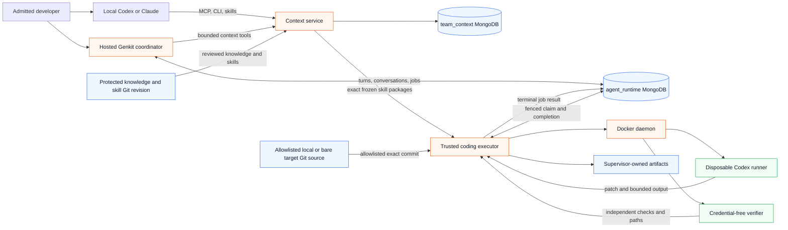

# Architecture

## Purpose and current state

The kit lets one small, trusted team expose its domain context to local and hosted agents without
making that context globally available or embedding authorization in prompts. Project/domain
admission is the content boundary; every admitted developer can use and contribute the complete
domain corpus. Genkit Python is the hosted orchestration runtime, initially through an explicit
OpenAI model configuration; local Codex
and Claude integrations remain independent of Genkit.

Migration proceeds as verified vertical slices. The current implementation includes a Python context
service that validates a Git-owned extension pack, reads one atomically active knowledge projection
at a pinned revision from MongoDB, and builds its skill catalog from that same revision. Explicit
local bootstrap can stage, verify, and activate fixture content; production startup only verifies
the already-published revision. Shared Python clients provide a
JSON-first context CLI, a five-tool stdio MCP adapter, and verified generic/Codex/Claude skill
distribution. S08 removed the previously delivered per-artifact groups and memory approval
workflow. Genkit compatibility, the stateless coordinator, application-owned durable conversations,
durable coding jobs, and supervised Codex execution against allowlisted local Git sources are
implemented. Slack ingress, real Git publication, and automation are not yet implemented.

## System map

The arrows show authority as well as data flow. Git is canonical for reviewed knowledge and skills.
MongoDB owns runtime and projection state, not canonical content. The trusted executor is the only
component that combines job state, repository admission, skill staging, Docker control, and durable
artifact writes. Disposable containers receive only the inputs needed for one fenced attempt.

## Runtime boundaries

Three runtime responsibilities define the security and lifecycle boundaries:

1. The team agent owns ingress, identities, conversations, Genkit execution, workflow routing, and
   automation records. It cannot directly access shared-context storage or repository shells.
2. The context service owns domain-admitted retrieval, ingestion, skills, supplemental shared working
   memory, narrow internal tools, and context audit. It does not approve canonical content or
   orchestrate arbitrary agents.
3. The coding runner handles one pinned repository job in a disposable workspace. A trusted
   supervisor owns credentials, policy, and independent checks. Any future publication capability
   belongs at that supervisor boundary; the current executor has no publication credential.

The current deployment units do not map one-to-one to those responsibilities. The context service
and coding runner have dedicated image targets. The hosted coordinator and trusted coding executor
are Python entry points. The credential-free verifier reuses the coding-runner image with a separate
entry point and stricter mounts and networking.

Genkit's model and agent execution is unrelated to the disposable coding runner. The OpenAI model
adapter is also distinct from the Codex CLI harness. Application code—not an agent prompt—owns
authorization, durable execution, validation, and external side effects.

The detailed container, verification, artifact, and recovery flow is documented in
[Supervised Codex coding runner](coding-runner.md).

## Source-of-truth boundaries

- A protected, pinned Git revision is the sole canonical source for knowledge, skills, conventions,
  and architecture decisions. Changes become canonical only through branch/commit/PR/team review.
- The `team_context` MongoDB database owns rebuildable knowledge projections, source revision state,
  supplemental shared working memory, idempotency receipts, and immutable context audit. It does
  not own canonical knowledge or the skill catalog.
- The `agent_runtime` MongoDB database owns application-level conversations, ordered turns, bounded
  summaries, short-lived turn claims, durable runs, leased coding jobs, execution progress, and
  durable artifact references. Genkit consumes bounded conversation context but does not own or
  persist the authoritative transcript. Later slices add Slack mappings, automations, reviews, and
  additional projections there.
- The databases use distinct service credentials. Only the context service can access `team_context`.
- Local agents and coding runners receive no MongoDB credentials.

The in-memory knowledge index remains available for tests and mock mode. Production uses the MongoDB
knowledge adapter with strict validators/indexes and independently builds the skill catalog from the
validated Git/filesystem content pack. The publication flow deterministically stages one exact Git
SHA, verifies it, and atomically activates it. Production service startup is read-only with respect
to publication and fails readiness unless the active knowledge revision equals the loaded skill
catalog revision. Explicit development bootstrap uses the same stage/verify/activate path.
Deployments must implement the generic production contract with merge-triggered CI plus scheduled
reconciliation; those platform-specific automations are not included yet.

The complete normative rules are in [Domain Knowledge Authority](domain-knowledge-authority.md),
and the publication lifecycle is in
[Required CI Implementation](required-ci-implementations.md).

## Extension and retrieval invariants

An extension pack contains a validated manifest, knowledge roots, and portable skill packages.
Every returned knowledge item carries repository, path, exact revision, and optional heading.
Project/domain admission is checked before retrieval; no record-level content groups or content
approver role exist. Repository content is untrusted input and cannot grant tool authority.

Skill metadata is bound to a project/domain declared by the extension manifest. The Git skill
catalog is bound to the configured extension checkout, and an admitted caller can use the complete
domain catalog. Non-admitted callers receive no domain content. Skill bodies retain
repository/path/revision provenance. The loader recursively inventories
bounded self-contained packages, rejects symlinks and unsafe or missing explicit resources, hashes
raw file bytes with bounded streaming reads, and derives provenance-bound content IDs. Resolution
verifies admission before revision errors and serves only the current catalog without substituting
another revision. The installer stages and verifies complete packages before an atomic per-package
replacement, writes a credential-free versioned lock plus a separate ownership manifest, and
preserves unmanaged and unselected content. Ownership records every installed path and hash, so a
replacement refuses edited or unexpected files. A recoverable journal retains package and metadata
backups through commit and rolls an interrupted pull back before the next pull proceeds. Frozen pulls
never resolve latest: an old lock requires the exact current-service package or a verified local
cache and otherwise fails. None of these interfaces are Genkit built-ins. Python JSON contracts use
snake_case.

REST is the primary context interface. The CLI and MCP adapters call those authenticated endpoints,
validate the same shared Pydantic contracts, preserve opaque cursors, and never receive database
credentials. Genkit-specific types stay inside `runtime_genkit`.

Shared working memory is immediately visible to the admitted team and always carries
`canonicality: supplemental`, provenance, evidence, author, revision, timestamps, and lifecycle
links. Every admitted developer can create and search it; operator REST/CLI surfaces also support
optimistic updates, atomic supersession through create, expiry, and audit. MCP exposes only
`search_team_memory` and `create_team_memory`. No operation promotes memory to canonical knowledge.
Conflicting Git content wins and the conflict must be surfaced.

Git-owned team skills remain provider neutral. The shared `SkillClient` resolves a selected domain
subset to an immutable lock and `SkillInstaller` installs a bounded generic projection or fixed
project-scoped Codex/Claude discovery layout. The hosted runtime points Genkit Skills middleware at
that projection. The coding executor retargets the same immutable generic lock to Codex, performs a
frozen verified install, and stages only that projection for the disposable runner. The checked-in
`developing-genkit-python` agent skill guides repository development only; it does not grant hosted
runtime capabilities.

## Operational invariants

- Network services expose liveness and dependency-aware readiness. Persistent polling workers rely
  on process supervision and successful dependency initialization; a dedicated executor health
  endpoint is not implemented yet.
- The context service receives only context-database credentials. Compose proves those credentials
  cannot read `agent_runtime`; a configuration guard also rejects identical database names.
- Logs and artifacts minimize and redact sensitive values.
- Retriable external actions use durable idempotency keys and reconcile uncertain outcomes.
- Coding runners receive no MongoDB, context-service, Git-publication, or Docker-socket credentials.
  The opt-in live Codex path mounts scoped model authentication into the runner and is explicitly an
  integration-grade boundary, not a production credential broker. Verification remains network-off
  and credential-free.
- Automatic merge, deploy, production mutation, unrestricted shell, and recursive agent spawning are
  outside the kit.
