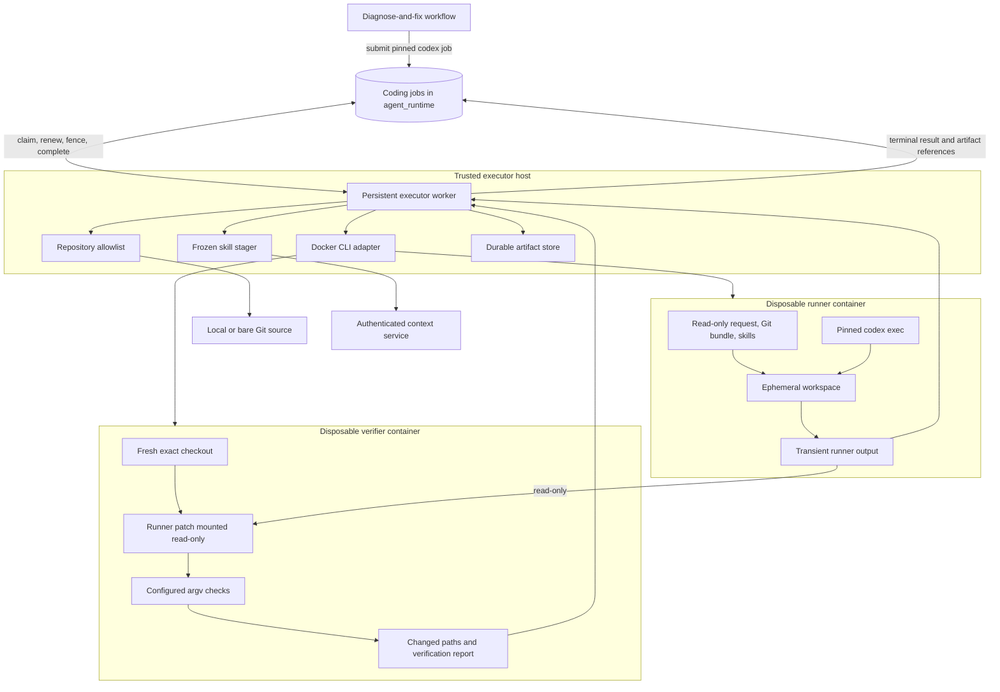
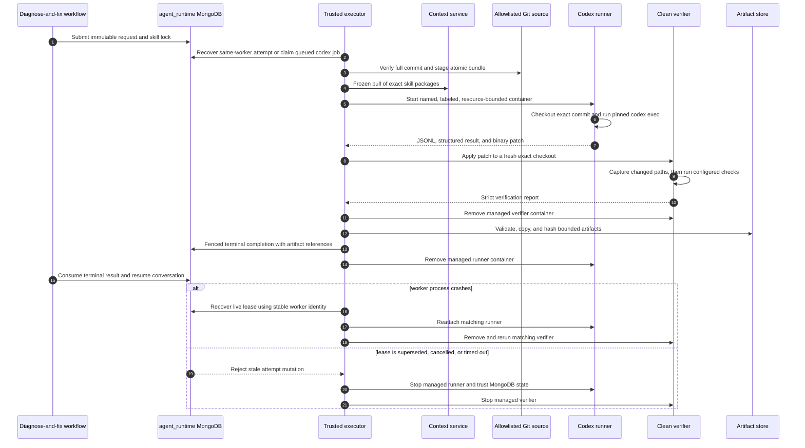

# Supervised Codex coding runner

S13 replaces the production mock execution boundary with a disposable Codex container. It does not
change the S12 workflow state machine: MongoDB remains authoritative for job/run lifecycle, and the
runner never receives MongoDB, context-service, or publication credentials.

## Component architecture



The worker is the trust boundary. It admits repository identifiers, verifies the exact commit and
skill lock, controls Docker, enforces resource and path policy, and is the only writer to durable
artifacts and job state. The Codex container may modify only its ephemeral workspace and transient
output. The verifier receives no model, MongoDB, context, publication, or Docker credentials.

| Component | Authority and credentials | Explicitly absent |
|---|---|---|
| Trusted executor | Runtime MongoDB credential, context-service token, Docker daemon authority, admitted local Git paths, durable artifact path, and optional scoped Codex home/network configuration | Git publication credential |
| Codex runner | Read-only job inputs and skill projection; opt-in live mode receives a read-only scoped Codex home and administrator-configured model network | MongoDB credential, context token, publication credential, Docker socket, host checkout |
| Verifier | Read-only job inputs and runner patch, isolated workspace, trusted check argv, transient report output | All service/model/publication credentials, network, Docker socket, host checkout |

The executor currently runs as a host-managed Python process, not as a Compose service. This keeps
Docker-daemon authority out of the application and context-service containers.

## One job attempt



## Execution boundary

`LocalDockerExecutor` claims one `harness=codex` job and renews its fenced attempt while
`LocalDockerRunner` performs these bounded phases:

1. Resolve the configured repository identifier to an administrator-provided local Git directory.
2. Verify the full commit object ID and create a bundle containing a deterministic temporary branch
   in an isolated bare staging clone. Remote repository URLs from job input are never cloned.
3. Retarget the job's immutable generic skill lock to `codex` and run a frozen verified install.
   Missing or corrupt exact packages fail startup; there is no resolution to a newer revision.
4. Reconcile or create a deterministic, labelled container for `(job_id, attempt,
   request_fingerprint)` and invoke pinned `codex exec` with ephemeral state, ignored user config,
   strict config, the workspace-write sandbox, automatic command approval within that sandbox,
   JSONL events, and a strict final output schema. Repository instructions and the staged project
   skills remain available inside the exact checkout.
5. Have the runner compute the binary Git patch and an initial path claim. The verifier independently
   recomputes actual changed paths from the applied patch. The supervisor enforces patch bytes,
   output bytes, path count, optional editable path prefixes, time, memory, CPU, and PID bounds.
6. Run configured argv checks in a fresh credential-free verifier container with networking off.
   The verifier applies the patch with Git, captures the actual changed paths before checks may alter
   the worktree, and writes its report to a separate output mount. It never trusts the runner's path
   claims.
7. Validate and copy the patch, JSONL, structured final output, and verification report from
   transient runner/verifier output directories into a supervisor-owned durable directory. Hash and
   persist those references before fenced Mongo completion. The S12 consumer then resumes the
   conversation normally.

The supervisor uses argv-only subprocess calls and a narrow Docker CLI adapter. It does not parse a
command policy language. Check commands and editable path prefixes are trusted workflow or
administrator configuration and must never be copied directly from untrusted user input. An empty
editable-prefix list means the whole checked-out repository is editable. The verifier decides patch
applicability and check success and derives the actual changed paths; the trusted supervisor applies
path policy and maps verification or policy failures to `unsafe_to_proceed`.

## Isolation and credentials

The coding-runner image is non-root. The container uses a read-only root filesystem, dropped Linux
capabilities, `no-new-privileges`, bounded resources, UID-owned tmpfs work/run directories, one
read-only input bind, and a transient UID-writable runner-output bind. The verifier mounts runner
output read-only and gets a different transient writable output bind. Only the supervisor writes the
durable artifact directory. Neither container mounts the host checkout or Docker socket.

The default deterministic path uses `network=none` and a fake Codex executable. Live Codex is
explicitly opt-in: `network=model_only` requires both a scoped Codex home and a configured Docker
network intended to constrain model egress. This is development/integration-grade credential
handling, not a production credential broker. The verifier always has `network=none` and receives
no Codex home.

## Restart behavior

The runner container name and labels are deterministic. After a supervisor restart, matching live
containers are waited on and matching exited containers with complete artifacts are collected.
A matching verifier left by a crash is removed and rerun against the immutable patch; verifier
execution is intentionally restartable rather than attachable. A name/label mismatch or unexpected
duplicate fails closed. Startup reconciliation scans both managed runner and verifier containers and
removes those whose Mongo job is absent, terminal, or on a different attempt. Attempt generation
remains the Mongo fencing boundary, so an older container cannot complete a newer attempt. Artifact
roots include a collision-resistant job digest and the attempt and are stored as relative durable
references. Runner cleanup follows durable artifact projection and terminal Mongo completion and is
safe to repeat.

## Worker configuration

`team-agent-coding-executor` is the persistent trusted supervisor entry point. `--once` performs at
most one recovery/claim cycle for probes and tests. It requires the runtime Mongo settings plus:

- `TEAM_AGENT_EXECUTOR_WORKER_ID`: stable identity used to recover a still-leased attempt after a
  process restart; only one live process may use a given identity.
- `TEAM_AGENT_EXECUTOR_REPOSITORIES`: JSON object mapping admitted repository identifiers to
  absolute local or bare Git paths.
- `TEAM_AGENT_CODING_RUNNER_IMAGE` and `TEAM_AGENT_CODING_ARTIFACT_ROOT`: pinned image and absolute
  supervisor-owned storage root.
- `TEAM_AGENT_CONTEXT_URL` and `TEAM_AGENT_TOKEN`: used only by the supervisor to fetch the exact
  packages named by the persisted skill lock.
- Optional `TEAM_AGENT_CODEX_HOME` and `TEAM_AGENT_CODEX_MODEL_NETWORK`: configured together only
  for the opt-in live-model path.

S13 intentionally does not add remote Git cloning, GitHub/GitLab publication, Kubernetes, Claude,
Temporal, multi-job joins, retained coding sessions, an event collection, or an outbox.

## Verification

The default suite executes the runner with a fake Codex binary and a real pinned Git bundle while
Docker itself is represented by a deterministic adapter. The adapter tests isolation, labels,
artifact ordering, path policy, verification, restart/orphan handling, completion, and cleanup. The
opt-in test below additionally executes a fixture repair in real Docker as UID 10002 with networking
off and validates the exact checkout, frozen skill projection, generated patch, independent verifier,
and durable artifacts.

Build and inspect the real image explicitly:

```sh
docker build --target coding-runner -t company/coding-runner:local .
RUN_LIVE_CODING_RUNNER_TESTS=1 \
TEAM_AGENT_CODING_RUNNER_IMAGE=company/coding-runner:local \
  uv run pytest tests/integration/test_live_coding_runner_image.py
```

Live model execution additionally requires the scoped Codex home and controlled model network. It
is never part of ordinary CI.
